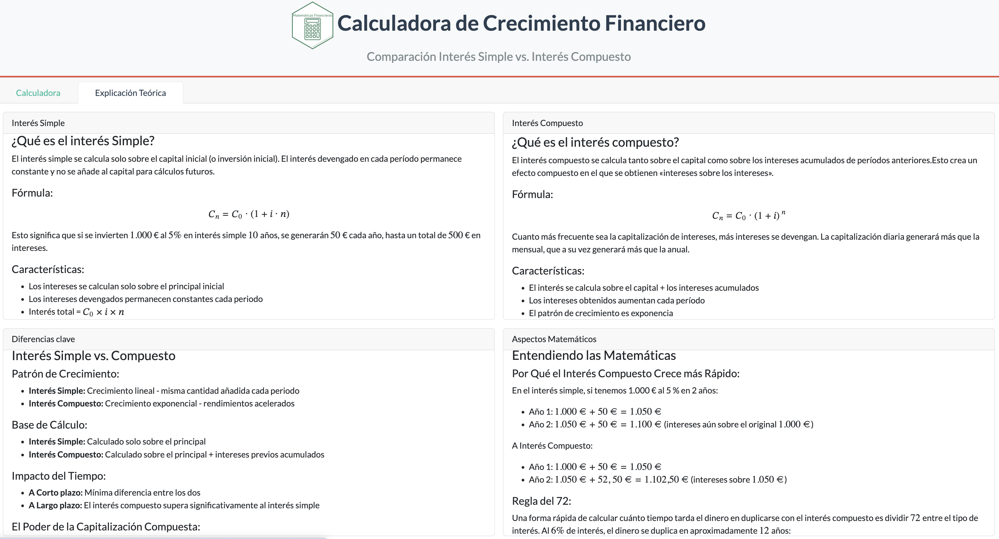
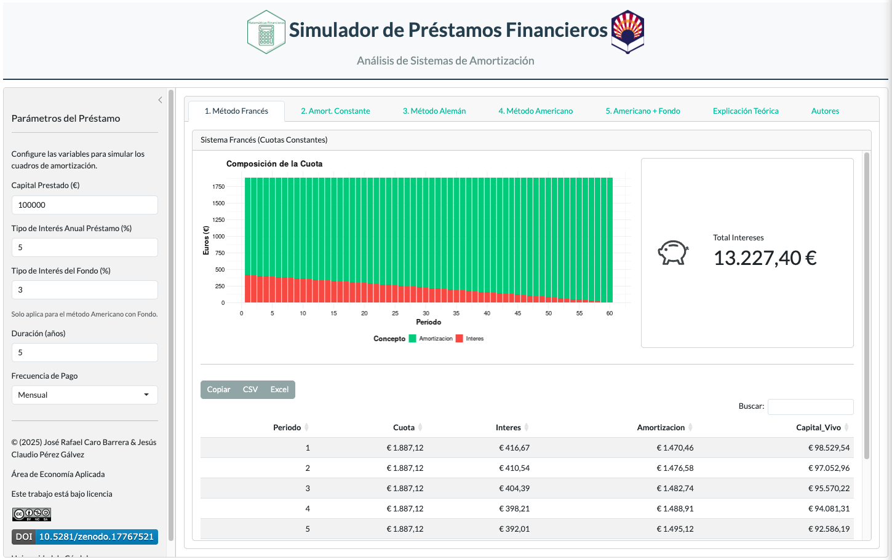
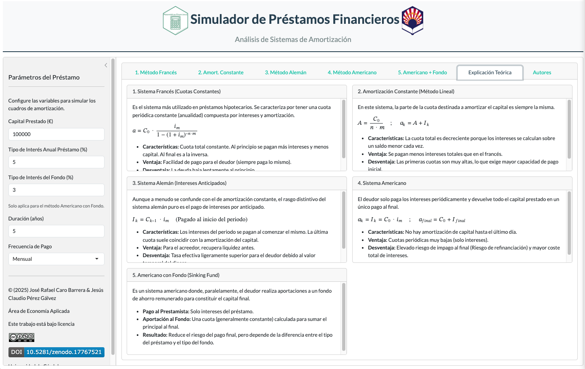

## Simple Interest vs. Compound Interest Simulator (in Spanish)

 
[{width="150"}](https://helvia.uco.es/xmlui/handle/10396/37014){target='_blank'}

A simple but yet powerful application to compare simple and compound interest.
The functioning is quite simple. The first tab is called "Calculator" and you can fix the values of the simulation: _Principal Amount_, _Interest Rate_, _Time_ (in years) and _Frequency of the compounding_ (times per year). The adjacent windows offer different calculations, starting from the formulas applied and the meaning of each term and continuing with the chart with both functions to see the evolution of each of them jointly and the table with the annual breakdown for each type of interest. The chart can be exported to a .jpeg file and also the table can be downloaded in an `xls` or `.csv` file to work locally within this formats. 

[{width="500"}](https://jrcaro.shinyapps.io/simplevscomp/){target='_blank'}

The second tab offers a theoretical explanation of both, the simple and compound interest from different perspectives, either quantitative (mathematically speaking with formulae) and qualitative (key differences, real world applications and why the compound interest grows faster than the simple one).

[{width="500"}](https://jrcaro.shinyapps.io/simplevscomp/){target='_blank'} 

[Link to the Spanish app](https://jrcaro.shinyapps.io/simplevscomp/){target='_blank'}

## Loan Repayment Methods Simulator  (in Spanish)

[{width="150"}](https://helvia.uco.es/xmlui/handle/10396/37016){target='_blank'}

The purpose  is to compare classic loan repayment systems. The app offers simulations of the most commonly used methods, that is French, Constant repayment, German method, American, and American plus sinking fund. It works like the previous app, for each tab you can specify the loan amount, the annual interest rate, the duration and the repayment frequency (only for the american with sinking fund modality it can be specified also the sinking fund interest rate).

[{width="500"}](https://jrcaro.shinyapps.io/loan/){target='_blank'}

The final tab offers a theoretical explanation of each type of loan, that is: main characteristics, advantages and disadvantages for either the borrower and the lender.

[{width="500"}](https://jrcaro.shinyapps.io/loan/){target='_blank'} 

[Link to the Spanish app](https://jrcaro.shinyapps.io/loan/){target='_blank'}

### Citations

If you use these dashboards or adapt it for your research, please cite:

> Caro-Barrera, J. R. and Pérez Gálvez, J. (2025). Financial Mathematics I - Simple vs Compound Interest Comparison [Computer software]. Zenodo. https://doi.org/10.5281/zenodo.17579699

> Caro-Barrera, J. R. and Pérez Gálvez, J. (2025). Financial Mathematics II - Types of Loans [Computer software]. Zenodo. https://doi.org/10.5281/zenodo.17767521

