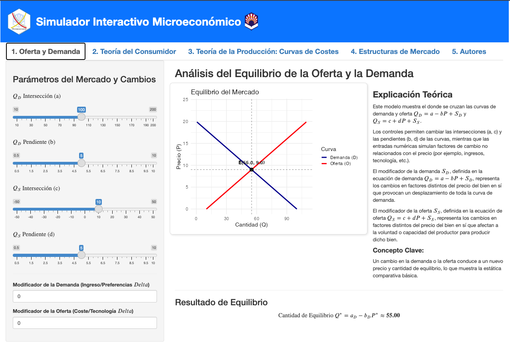
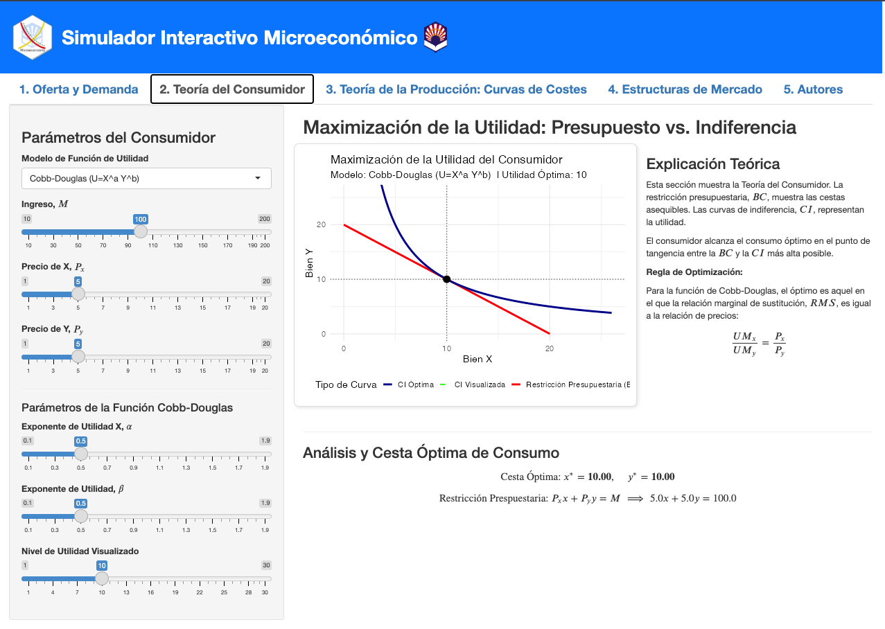
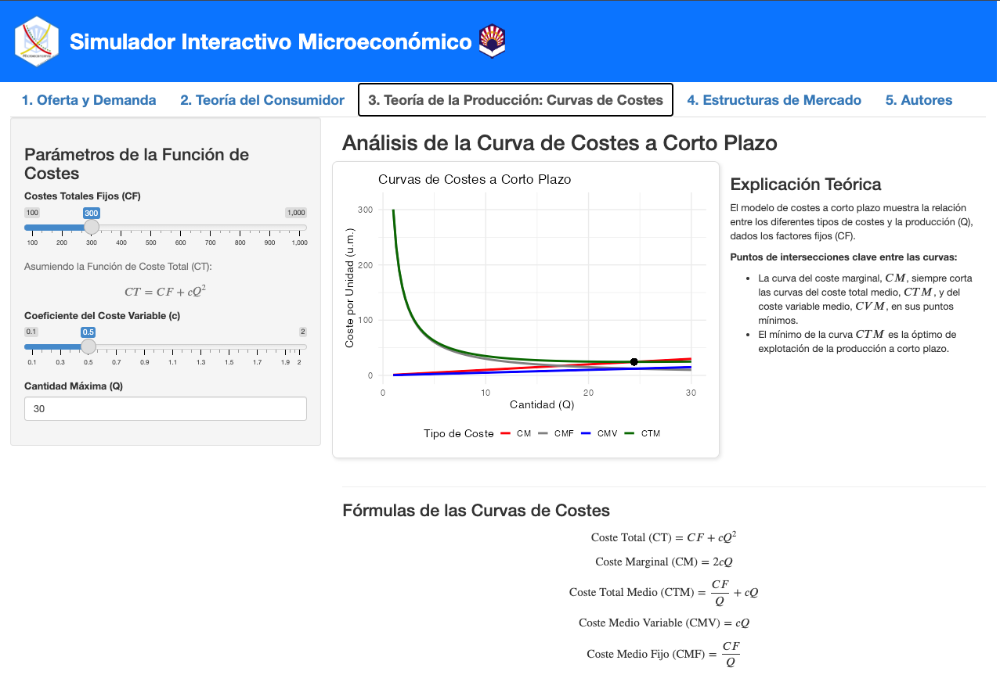
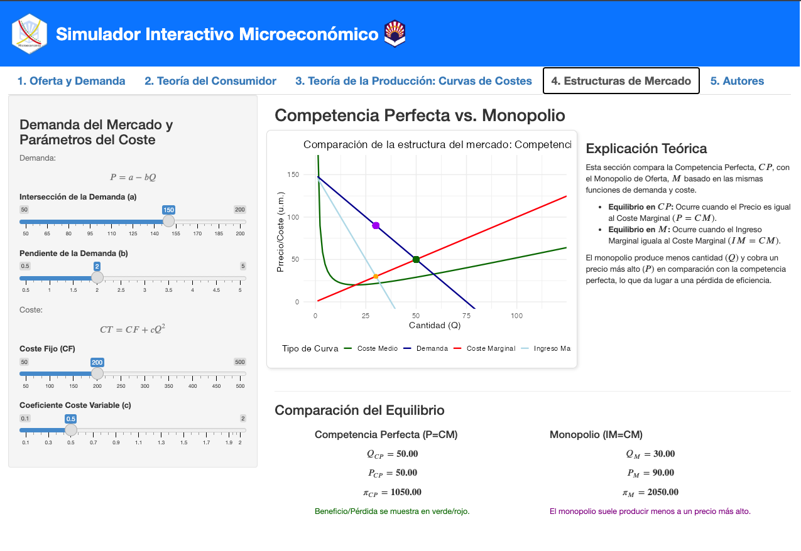

## Microeconomics Simulator (in Spanish)

[{width="150"}](https://helvia.uco.es/xmlui/handle/10396/37023){target='_blank'}

Microeconomics, especially Price Theory, is one integral feature of major programs: undergraduate and graduate courses in economics, business, and social sciences related to price theory. 

Here an interactive microeconomic simulator was created with R Shiny. With the app students are able to modify major features of traditional microeconomic models, and track their impact in real time. Rather than complement lectures or set up problems they need, the simulator is designed to stimulate these by converting abstract models into interactive learning environments. 
This project contributes to the developing landscape of the subject-matter for classroom teaching by the presentation of an interactive web application crafted with the R Shiny framework. Its main character is that of a visual laboratory for teaching fundamental microeconomic concepts. This includes consumer theory, firm theory and basic market structure principles.

[**Link to the Microeconomics Simulator**](https://jrcaro.shinyapps.io/microeconomics/){target='_blank'}

**This work has been presented in the** [_**20th Annual International Technology, Education and Development Conference**_](https://iated.org/archive/inted2026) [(**INTED 2026**)](../../talks/index.qmd)

### 1. Supply and Demand

The Supply and Demand tab introduces students to the fundamental logic of market equilibrium. In linear form, demand and supply functions are specified. Additionally, the module provides explicit changes in income, preferences, technology, or production costs (and demand and supply shifters represented as well). 
When parameters are changed, we instantly update demand and supply curves, recalculate equilibrium price and quantity, and, upon the new, we recalculate equilibrium quantity and price on graph. This instant feedback makes comparative statics real. Students can clearly distinguish between a movement along a curve and a shift of the curve itself, a distinction that can be so confusing when beginning a series of introductory classes.
The accompanying theoretical explanation panel further elaborates on the graphical insights, using visual changes to inform economic reasoning. This module particularly lends itself to discussion and makes an excellent place to prompt students to explain themselves more specifically, in their own words, for classroom use.

[{width="500"}](https://jrcaro.shinyapps.io/microeconomics/){target='_blank'}

### 2. Consumer Theory

The second tab examines utility maximization within the constraint of a budget. The module is aimed at a clear and intuitive visualization of interactions of preferences, price, and income. Preferences is treated as a Cobb–Douglas utility function and income and prices are interactively modifiable. 

On the visual side, we see the budget constraint alongside indifference curves, where the optimal consumption bundle emerges at the tangency point. When the parameters change, the best bundle is optimally adjusted in real time which allows students to see the income effects, price effects and how preferences determine trade-off effects. 

[{width="500"}](https://jrcaro.shinyapps.io/microeconomics/){target='_blank'} 

### 3. Curves Costs

The third module gives students an insight into the interrelationship between production technology and three models of cost curves including total cost, average cost, and marginal cost. Students notice how the cost curves shift as parameters regarding technology and fixed costs adjust and how their shapes change. 

The fact that marginal cost intersects average cost at its minimum is particularly useful in terms of understanding why marginal cost meets average cost at its minimum and how technological improvement impacts production decisions. 
In the teaching, the module has been leveraged as an adjunct to algebraic derivations and to assist visual intuition to support students comprehending relationships between cost that at traditional times might appear as simple pure technical reasoning
 
[{width="500"}](https://jrcaro.shinyapps.io/microeconomics/){target='_blank'} 

### 4. Market Structures

The Market structures' tab introduces students to basic market structures with an emphasis on perfect competition and monopoly. The module builds on previous sections by linking cost curves to firm-level outcomes and to market-level outcomes.
In instances of perfect competition, students can examine how firms maximize their profits where price equals marginal cost and how market supply emerges from individual firm behaviour. In the monopoly case, the use of the application demonstrates marginal revenue as a key factor, and also illustrates the differences between competitive and monopolistic outcomes in terms of price, quantity, and welfare. 

[{width="500"}](https://jrcaro.shinyapps.io/microeconomics/){target='_blank'} 

### Citation

If you use this dashboard or adapt it for your research, please cite:

> Caro-Barrera, J. R., Gomez-Casero, G., García-Moreno García, M. de . los B., & Pérez Gálvez, J. C. (2026). Interactive Microeconomic Simulator [Graphic]. https://doi.org/10.5281/zenodo.18220705

