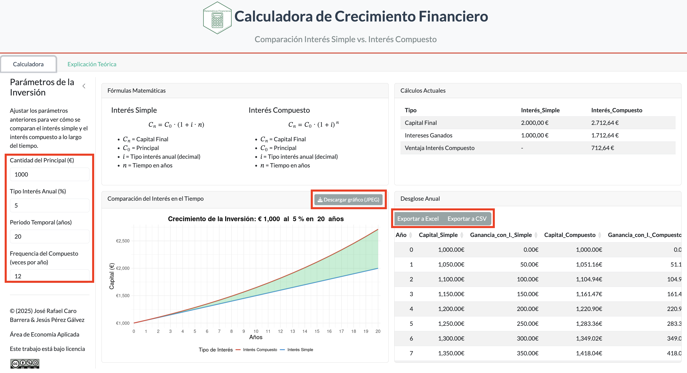

> "_An image is worth than 1000 words._" (Frederick R. Barnard, 1921)

Sometimes it's better to show concepts to students through simulation, letting them practice on their own. This is especially true in fields like statistics, economics, or finance, where visual representation is essential to understanding certain concepts. As a teacher of financial mathematics, microeconomics, and macroeconomics, data visualization plays an important role in these courses. I have developed a few applications in the Shiny environment to help students explore how the underlying models react as they change the parameters themselves, rather than just reading about the theory. Links to the apps for each course are below.

## Apps and Simulators

These are largely [R shiny](https://shiny.rstudio.com/) apps developed to demonstrate economic concepts for my economics courses. The main purpose is to visualize concepts in action (often through a plot, chart or table) and especially show how key parameters affect the outcome by allowing users to change these values and see the chart update dynamically.

:::::: {.grid}

::::: {.card .g-col-12 .g-col-sm-4}

[{.card-img-top}](2026_finmatapp/index.qmd)

:::: {.card-body}

#### Financial Maths

Teaching resources for the Spanish course **Financial Mathematics**

[ Site](https://jrcaro.shinyapps.io/simplevscomp/){.card-link} [ Source](https://github.com/jrcarob){.card-link}
{target="_blank"}
{target="_blank"}

::::

:::::

::::: {.card .g-col-12 .g-col-sm-4}

[{.card-img-top}](2026_microapp/index.qmd)

:::: {.card-body}

#### Microeconomics

Teaching resource for the Spanish course **Microeconomics**

[ Site](https://jrcaro.shinyapps.io/microeconomics/){.card-link} [ Source](https://github.com/jrcarob){.card-link}
{target="_blank"}

::::

:::::

::::::

