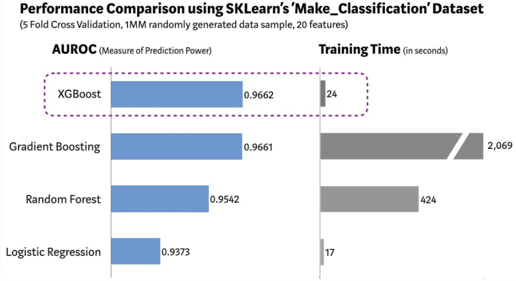
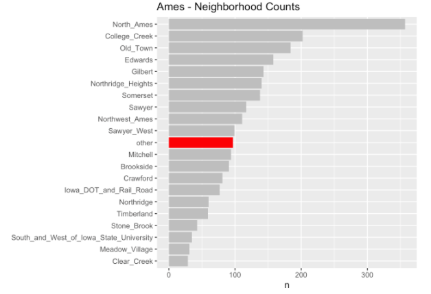
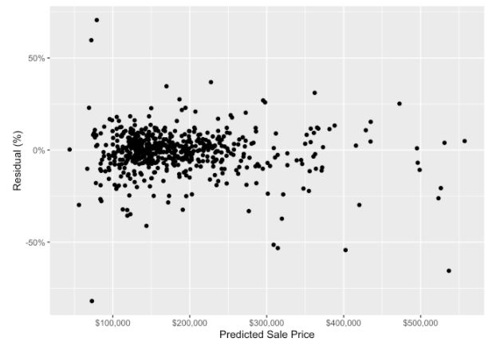

# 1. Introduction to the XGBoost algorithm

XGBoost, (*Extreme Gradient Boosting*), is one of the most widely used supervised _machine learning_ algorithms that uses the _boosting_ principle.

Supervised learning is one that has input variables $(x)$ and an output variable and an output variable $(Y)$  and uses an algorithm to learn the mapping function of the input $$Y=f(X)$$ to the output.The objective is to approximate the mapping function as accurately as possible so that when you have new input data $(x)$, the output variables $(Y)$ can be predicted for that data.

It is called supervised learning because the process of an algorithm learning from the training data set can be thought of as a teacher supervising the learning process. We know the correct answers, the algorithm iteratively makes predictions on the training data and is corrected by the teacher. Learning stops when the algorithm reaches an acceptable level of performance.

Supervised learning problems can be grouped into regression and classification problems.

$\bullet$ **Classification:** A classification problem is when the output variable is a category, such as “red” or “blue” or “disease” and “no disease”.

$\bullet$ **Regression:** A regression problem is when the output variable is a real value, such as “euros” or “kilograms”. Some common types of problems built on classification and regression include recommendation and time series prediction, respectively. Some popular examples of supervised machine learning algorithms are:

***Linear regression*** for regression problems.

***Random forest*** for classification and regression problems.

***Support vector machine*** for classification problems.

The *xgboost* algorithm is similar to *gradient boosting* but more efficient. It has linear model solutions and tree learning algorithms and is at least 10 times faster than existing implementations of *gradient boosting*. It supports several objective functions, including regression, classification and ranking. and what makes it fast is its ability to do parallel computations on a single machine.

In terms of efficiency, accuracy and feasibility it is more powerful than the _random forest_ algorithm, for example or a neural network and since it has very high predictive power but relatively slow implementation, _xgboost_ becomes a suitable choice for solving most regression, classification and ranking problems as well as user-created objective functions. It also has additional features to do cross validation and find the most important variables, which makes it interesting for **credit scoring models**, **insurance claims**, or where there are many parameters to be controlled to optimize the model.

As can be seen in the following graph (1), the XGBoost model has the best combination of prediction performance and processing time compared to other algorithms.

[](performance.png)


Chollet and Allaire, (2018) (2) summarize the value of XGBoost as follows:

> "*XGBoost* is used for problems where there is the availability of structured data is very wide, while _deep learning_ is used for perceptual problems such as image classification. Users of the former almost always use the XGBoost library."

> "These are the two techniques that one should be most familiar with to be successful in applied machine learning today: gradient boosting machines, for shallow learning problems; and deep learning, for perceptual problems. In technical terms, this means that one should be familiar with XGBoost and Keras."

> `r tint::quote_footer('-- Francoise Chollet and J.J. Allaire')`

Originally, XGBoost is a library written in C++ and exported to **R** in the `xgboost` package in our case, the XGBoost model has been trained using the package in **R** `caret`(3).

# 2. Objectives and data preparation

In this post and preliminary preview of the project with data application to the Spanish real estate market we train and tune a model based on the XGBoost algorithm using the *tidymodels* library of `R`. For this purpose and as data source we use the [AmesHousing dataset](https://cran.r-project.org/web/packages/AmesHousing/AmesHousing.pdf) (4) which contains data of 82 variables for 2,930 properties in Ames County, Iowa. Our model will attempt to predict the selling price of the home.

<div class='fold s'>
```{r, message=FALSE, warning=FALSE, results='hide'}
# Data load
library(AmesHousing)

# Cleaning and data preparation libraries
library(janitor)
library(dplyr)

# Libraries needed
library(rsample)
library(recipes)
library(parsnip)
library(tune)
library(dials)
library(workflows)
library(yardstick)

# acceleration of calculations with parallel processing (optional but useful)
library(doParallel)
all_cores <- parallel::detectCores(logical = FALSE)
registerDoParallel(cores = all_cores)
```
</div>

### 2.1. Data load for modelling

<div class='fold s'>
```{r, message=FALSE, warning=FALSE, results='hide'}
# random seed set.seed() for results to be replicable
# 
set.seed(1234)

# data load and cleaning names
ames_data <- make_ames() %>%
  janitor::clean_names()
```
</div>

# 3. XGBoost Process

## 3.1. Exploratory Data Analysis.

At this initial point, we would do summaries of the data and some simple graphs to get as detailed an understanding of the data as possible. For simplicity, we are going to skip this step but, in a real-world analysis, understanding the business issues and doing an effective EDA are often the crucial aspects that require the most time and analysis.

## 3.2. Splitting the Data.

We now divide the data into training and test data. The training data is used for model training and hyperparameter fitting. Once trained, the model can be evaluated against the test data to assess accuracy. Typically, 80% of the data is used for model training, while simulation or testing is done with the remaining 20%.

<div class='fold s'>
```{r, message=FALSE, warning=FALSE, results='hide'}
# Data split for training and testing. Stratification by sales price
ames_split <- rsample::initial_split(
  ames_data, 
  prop = 0.8, 
  strata = sale_price
)
```
</div>

## 3.3. Pre-processing.

Preprocessing alters the data to make our model more predictive and the training process requires less computational calculations. Many models require careful and extensive variable preprocessing to produce accurate predictions. However, XGBoost is more robust to highly asymmetric and/or correlated data, so the amount of preprocessing required with XGBoost is minimal. However, we can still make use of some preprocessing, and in **R**, with the libraries that `tidymodels` uses, we use the `recipes` package to define these aforementioned preprocessing steps:

<div class='fold s'>
```{r, message=FALSE, warning=FALSE, results='hide'}
# preprocessing routine
preprocessing_recipe <- 
  recipes::recipe(sale_price ~ ., data = training(ames_split)) %>%
  # categorical variables to factor variables conversion
  recipes::step_string2factor(all_nominal()) %>%
  # low frequency factor levels combination
  recipes::step_other(all_nominal(), threshold = 0.01) %>%
  # remove of predictors without variance that do not provide predicitive information
  recipes::step_nzv(all_nominal()) %>%
  prep()
```
</div>

As can be seen in the graph below, for the `neighborhood` variable, several of the factor levels with the smallest number of observations (less than 1% of the total number of observations) have been grouped into an `other` factor level. We did this preprocessing with the `step_other()` command in the previous section.

[](others.png)

## 3.4. Cross-validation split.

We apply the preprocessing previously defined with the `bake()` command. Then, we use cross-validation to randomly split the training data into additional training and test sets. We will use these additional cross-validation folds to adjust our hyperparameters in a later step.

<div class='fold s'>
```{r, message=FALSE, warning=FALSE, results='hide'}
ames_cv_folds <- 
  recipes::bake(
    preprocessing_recipe, 
    new_data = training(ames_split)
  ) %>%  
  rsample::vfold_cv(v = 5)
```
</div>

## 3.5. XGBoost model specification.

We use the `parsnip` package to define the XGBoost model specification. We then use `boost_tree()` together with `tune()` to define the hyperparameters for tuning in a later step.

<div class='fold s'>
```{r, message=FALSE, warning=FALSE, results='hide'}
# Model specification
xgboost_model <- 
  parsnip::boost_tree(
    mode = "regression",
    trees = 1000,
    min_n = tune(),
    tree_depth = tune(),
    learn_rate = tune(),
    loss_reduction = tune()
  ) %>%
    set_engine("xgboost", objective = "reg:squarederror")
```
</div>

## 3.6. Grid specification.

Next, we use the `dials` package to specify the set of parameters.

<div class='fold s'>
```{r, message=FALSE, warning=FALSE, results='hide'}
# Grid setup
xgboost_params <- 
  dials::parameters(
    min_n(),
    tree_depth(),
    learn_rate(),
    loss_reduction()
  )
```
</div>

Then we set up the _grid_ space. The `dials::grid_*` functions support several methods to define this space.Using the `dials::grid_max_entropy()` function covers the hyperparameter space so that any part of the space has an observed combination that does not lie too far from it.

<div class='fold s'>
```{r, message=FALSE, warning=FALSE, results='hide'}
xgboost_grid <- 
  dials::grid_max_entropy(
    xgboost_params, 
    size = 60
  )

knitr::kable(head(xgboost_grid))
```
</div>

| min_n 	| tree_depth 	| learn_rate 	| loss_reduction 	|
|:-----:	|:----------:	|:----------:	|:--------------:	|
|   34  	|      1     	|  0.0118682 	|   29.9649253   	|
|   38  	|     12     	|  0.0001291 	|    0.6156496   	|
|   6   	|      7     	|  0.0000949 	|    0.0000000   	|
|   32  	|      4     	|  0.0000005 	|    0.0000367   	|
|   14  	|      2     	|  0.0001833 	|    0.0000000   	|
|   31  	|      8     	|  0.0000000 	|    1.4345098   	|

To fit our model, we perform a _grid_ search over that `xgboost_grid` grid space to identify the hyperparameter values that have the lowest prediction error.

## 3.7. Workflow setup

We use the new `tidymodel` workflow package to add a formula to our XGBoost model specification.

<div class='fold s'>
```{r, message=FALSE, warning=FALSE, results='hide'}
xgboost_wf <- 
  workflows::workflow() %>%
  add_model(xgboost_model) %>% 
  add_formula(sale_price ~ .)

```
</div>

## 3.8. Model fitting

The "fitting" is where the `tidymodels` package _ecosystem_ actually comes into play. Here's a quick breakdown of the objects passed to the first 4 arguments of our `tune_grid()` call below:

$\bullet$ "object": `xgboost_wf`, which is a workflow we defined by the `parsnip` and `workflows` packages.

$\bullet$ "resamples": `ames_cv_folds` as defined by the `rsample` and `recipes` packages.

$\bullet$ "grid": `xgboost_grid` our space as defined by the `dials` package.

$\bullet$ "metrics": the `yardstick` package defines the set of metrics used to evaluate model performance.

<div class='fold s'>
```{r, eval=FALSE, message=FALSE, warning=FALSE, results='hide'}
# hyperparameters tuning
xgboost_tuned <- tune::tune_grid(
  object = xgboost_wf,
  resamples = ames_cv_folds,
  grid = xgboost_grid,
  metrics = yardstick::metric_set(rmse, rsq, mae),
  control = tune::control_grid(verbose = TRUE)
)
```
</div>

In the above code block, `tune_grid()` performed a search for the _grid_ on all 60 parameter combinations defined with `xgboost_grid` and used 5-fold cross-validation along with the _rmse_ (root mean square error), _rsq_ ($R^{2}$) and _mae_ (mean absolute error) to measure prediction accuracy. Therefore, our fit only fits (worth the redundancy) $60\times 5=300$ XGBoost models, each with 1,000 trees, all in search of the optimal hyperparameters. The computation was considerably time consuming and not without its share of problems. The hyperparameter values that performed best in minimizing the mean square error are shown below:

<div class='fold s'>
```{r, eval=FALSE, message=FALSE, warning=FALSE, results='hide'}
xgboost_tuned %>%
  tune::show_best(metric = "rmse") %>%
  knitr::kable()
```
</div>

| min_n 	| tree_depth 	| learn_rate 	| loss_reduction 	| .metric 	| .estimator 	|   mean   	| n 	|  std_err 	|
|:-----:	|:----------:	|:----------:	|:--------------:	|:-------:	|:----------:	|:--------:	|:-:	|:--------:	|
|   12  	|      7     	|  0.0346875 	|    0.0451186   	|   rmse  	|  standard  	| 25561.99 	| 5 	| 2983.927 	|
|   9   	|     13     	|  0.0183617 	|    0.1042750   	|   rmse  	|  standard  	| 25576.99 	| 5 	| 2687.849 	|
|   23  	|      5     	|  0.0788798 	|    0.7513677   	|   rmse  	|  standard  	| 25645.38 	| 5 	| 2461.057 	|
|   11  	|      6     	|  0.0091690 	|    0.0000001   	|   rmse  	|  standard  	| 25669.84 	| 5 	| 2706.457 	|
|   10  	|      2     	|  0.0108475 	|    0.0000003   	|   rmse  	|  standard  	| 25883.23 	| 5 	| 2828.172 	|

Next, we isolate the best performing hyperparameter values.

<div class='fold s'>
```{r, eval=FALSE, message=FALSE, warning=FALSE, results='hide'}
xgboost_best_params <- xgboost_tuned %>%
  tune::select_best("rmse")

knitr::kable(xgboost_best_params)
```
</div>

| min_n 	| tree_depth 	| learn_rate 	| loss_reduction 	|
|:-----:	|:----------:	|:----------:	|:--------------:	|
|   12  	|      7     	|  0.0346875 	|    0.0451186   	|

We finish the XGBoost model using the best parameter we have set.

<div class='fold s'>
```{r, eval=FALSE, message=FALSE, warning=FALSE, results='hide'}
xgboost_model_final <- xgboost_model %>% 
  finalize_model(xgboost_best_params)
```
</div>

## 3.9. Performance Evaluation with Test Data.

Now that we have trained our model, we need to evaluate the performance of the model. We use the test data from step 1 (that 20% of data that was not used in model training) to evaluate the performance.

We use the _rmse_ (Root Mean Squared Error), rsq (R Squared) and mae (Mean Absolute Value) metrics from the `yardstick` package in our model evaluation.

First, we evaluated the training data metrics:

<div class='fold s'>
```{r, eval=FALSE, message=FALSE, warning=FALSE, results='hide'}
train_processed <- bake(preprocessing_recipe,  new_data = training(ames_split))

train_prediction <- xgboost_model_final %>%
  # model fit on all training data
  fit(
    formula = sale_price ~ ., 
    data    = train_processed
  ) %>%
  # prediction of sales prices on training data
  predict(new_data = train_processed) %>%
  bind_cols(training(ames_split))

xgboost_score_train <- 
  train_prediction %>%
  yardstick::metrics(sale_price, .pred) %>%
  mutate(.estimate = format(round(.estimate, 2), big.mark = ","))

knitr::kable(xgboost_score_train)
```
</div>

| .metric 	| estimator. 	| .estimate 	|
|:-------:	|:----------:	|:---------:	|
|   rmse  	|  standard  	|  3,807.24 	|
|   rsq   	|  standard  	|    1.00   	|
|   mae   	|  standard  	|  2,747.17 	|

And now for the rest of the data:

<div class='fold s'>
```{r, eval=FALSE, message=FALSE, warning=FALSE, results='hide'}
test_processed  <- bake(preprocessing_recipe, new_data = testing(ames_split))

test_prediction <- xgboost_model_final %>%
  # model fit on all training data
  fit(
    formula = sale_price ~ ., 
    data    = train_processed
  ) %>%
  # use of the training fit model for test data prediction
  predict(new_data = test_processed) %>%
  bind_cols(testing(ames_split))

# measuring the accuracy of our model using `yardstick`.
xgboost_score <- 
  test_prediction %>%
  yardstick::metrics(sale_price, .pred) %>%
  mutate(.estimate = format(round(.estimate, 2), big.mark = ","))

knitr::kable(xgboost_score)
```
</div>

| .metric 	| estimator. 	| .estimate 	|
|:-------:	|:----------:	|:---------:	|
|   rmse  	|  standard  	| 30,217.58 	|
|   rsq   	|  standard  	|    0.87   	|
|   mae   	|  standard  	| 15,728.22 	|

The above metrics in the test data are significantly worse than the metrics in our training data, so we know that there is some overfitting in our model. This highlights the importance of using test data, rather than training data, to evaluate model performance.

To quickly check that there is not a problem with our model predictions, we can obtain the plot of the test data residuals:

<div class='fold s'>
```{r, eval=FALSE, message=FALSE, warning=FALSE, results='hide'}
house_prediction_residual <- test_prediction %>%
  arrange(.pred) %>%
  mutate(residual_pct = (sale_price - .pred) / .pred) %>%
  select(.pred, residual_pct)

ggplot(house_prediction_residual, aes(x = .pred, y = residual_pct)) +
  geom_point() +
  xlab("Predicted Sale Price") +
  ylab("Residual (%)") +
  scale_x_continuous(labels = scales::dollar_format()) +
  scale_y_continuous(labels = scales::percent)
```
</div>

[](residuals.png)

The above plot does not show very obvious trends in residuals. This indicates that, at a very high level, our model is not systematically making inaccurate predictions for homes with certain predicted sales prices. We would do more model validation here for a real-world analysis, but, for the sake of this publication, the above graph is good enough for our purpose.

# Conclusions

The objective of this analysis was to work through the training process of an XGBoost model in **R** using the `tidymodels` package, and to learn the basics of how the algorithm works, although we have not put too much emphasis on the performance of our model, the foundations for future lines of research with this tool have been laid.

We have seen that the `tidymodels` library provides us with a standard process and tools to handle resampling (`rsample`), data preprocessing (`recipes`), model specification (`parsnip`), fitting (`tune`) and model validation (`yardstick`). In this sense, the `tidymodels` ability to `sort` the machine learning process is a step-change improvement for machine learning accessibility in **R**; thus, it is easier to train and understand the XGBoost model training process.

# References

1. https://towardsdatascience.com/https-medium-com-vishalmorde-xgboost-algorithm-long-she-may-rein-edd9f99be63d

2. Chollet, F. and Allaire, J. J. (2018): _"Deep Learning with R,"_ Ed. Manning Publications.

3. Kuhn, M. (2008). _"Building Predictive Models in R Using the caret Package,"_ Journal of Statistical Software, 28(5), 1-26; doi:http://dx.doi.org/10.18637/jss.v028.i05.

4. De Cock, D. (2011). _"Ames, Iowa: Alternative to the Boston Housing Data as an End of Semester Regression Project,"_: Journal of Statistics Education, Volume 19, Number 3.

5. Chen, T. and Guestrin, C. (2016): _"XGBoost: A Scalable Tree Boosting System,"_ doi:10.1145/2939672.2939785

6. Friedman, J.H. (2001): _"Greedy Function Approximation: A Gradient Boosting Machine,"_ Annals of Statistics, pp. 1189–1232.
