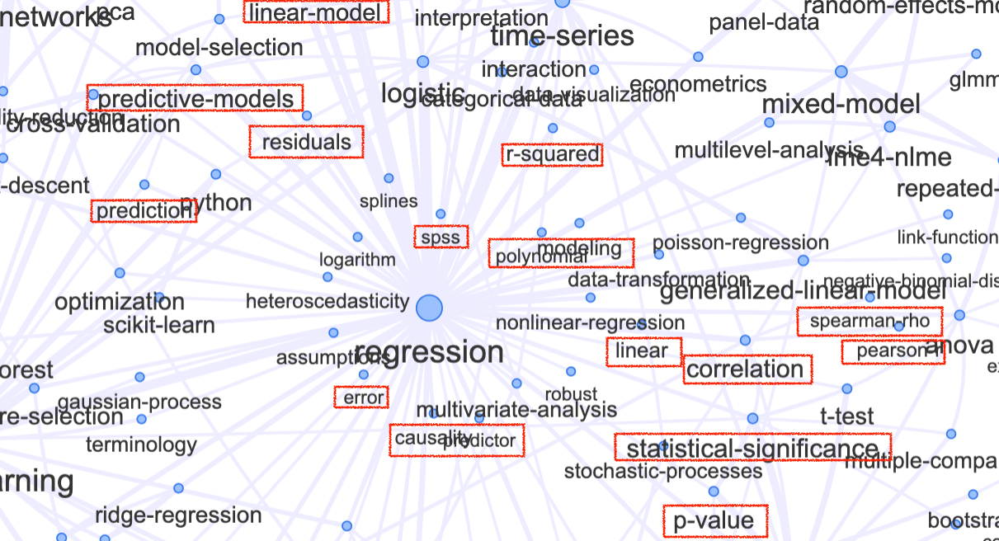

::: goals
::: goals-header
Learning goals
:::

::: goals-container
-   To learn how to apply linear regression models in practice.
-   To identify the predictor and the reponse variables.
-   To interpret estimates and diagnostic statistics.
:::
:::

::: callout-important
## Better to remember some of the concepts already studied!

Have a look at the network graph, see the the complex intrincacies of the regression analysis and check out if you remember some of the concepts (in the red boxes) we have already studied. Don't panic! You do not have to know all of them and you won't study the most of them, just keep in mind some of the concepts (which means review them) for the lecture.


:::

## What is Regression Analysis?


<!-- [Referencia 1:](https://deasadiqbal.medium.com/demystifying-machine-learning-a-guided-tour-of-the-top-10-algorithms-3fee19d6c2a8)
[Referencia 2:](https://medium.com/analysts-corner/mastering-regression-analysis-from-basics-to-advanced-applications-in-python-and-r-532e100e0fa0)
[Referencia 3:](https://medium.com/the-stata-gallery/correlation-vs-regression-a-key-difference-that-many-analysts-miss-3770c9b368d9)
-->

Regression analysis is a statistical method used **to predict the value of a dependent variable based on the values of one or more independent variables**. It involves analyzing the relationship between the dependent variable and the independent variables to understand how changes in the independent variables affect the dependent variable.

The independent variables, also known as *predictors*, are used to estimate or "predict" the value of the *dependent* variable. The relationship between the variables is typically represented by an equation or a mathematical model. The regression model estimates the relationship by fitting a line (or curve) through the data points, allowing for the prediction of the dependent variable for given values of the independent variables.

Regression analysis can be used to measure the influence of one or multiple variables on another variable. By identifying the strength and direction of the relationship, regression analysis helps researchers and analysts to understand the underlying factors that impact the dependent variable. It is a powerful tool for making predictions, forecasting future outcomes, and understanding the complex mechanisms driving the variables of interest.

Regression analysis finds applications in various fields such as economics, finance, social sciences, and healthcare. In economics, it can be used to analyze the relationship between factors like income, inflation, and consumer spending. In finance, it aids in predicting stock prices and identifying factors that impact investment returns. In the social sciences, regression analysis is used to study the impact of variables like education, income, and demographic characteristics on various outcomes. In healthcare, it helps in understanding the factors influencing patient outcomes and optimizing treatment strategies.

<!--
Regression analysis provides valuable insights into the relationship between variables and helps to make informed decisions. By examining the statistical significance of the independent variables, researchers can determine whether a particular variable has a significant impact on the dependent variable. The coefficients of the independent variables provide information about the direction and magnitude of the relationship.-->

Regression analysis can also assist in model validation and hypothesis testing. Researchers can develop different regression models to test alternative hypotheses and evaluate the significance of each variable. The quality of the regression model can be assessed by examining various statistical measures such as $R^{2}$ and *p*-values. These measures provide information about the *goodness-of-fit* of the model and the *statistical significance* of the coefficients.

<!--
Overall, regression analysis is a versatile and widely used statistical technique that helps in understanding the relationship between variables and making predictions or forecasts. By providing a quantitative approach to analyzing data, regression analysis enhances decision-making and enables researchers to draw meaningful conclusions from complex datasets. Its applications span across various disciplines and play a vital role in shaping our understanding of the world around us.-->

In the field of statistics, regression analysis is a widely used method for modeling the relationship between a dependent variable and one or more independent variables. It helps in understanding the nature and strength of the relationship between variables, making predictions, and drawing inferences. There are various types of regression analysis, each suitable for different scenarios and data types. In this post, we will explore the simple and multiple linear regression, however, another common types of regression models are: logistic regression, ordinal regression, and nominal regression among others.

## The motive behind linear regression

Linear regression is useful when we suspect a **linear relationship** between variables (known as explanatory variables, predictors, or covariates) and a response variable. While it may seem straightforward, linear regression is a powerful and widely used statistical learning method.

### Simple Linear Regression

::: note
**Simple linear regression** is the most basic form of regression analysis, where a single independent variable is used to predict the value of the dependent variable. The relationship between the independent variable $x$ and dependent variable $y$ is assumed to be linear, following a straight line equation: $$y=\alpha+\beta\cdot x+\varepsilon$$
Note that the notation may also be given as: 
$$ y=\beta_{0} + \beta_{1}\cdot x+\varepsilon,$$
being both equivalent.

Here, the coefficients $\beta_{0}$ and $\beta_{1}$ are the intercept and slope coefficients, respectively, and $\varepsilon$ represents the random error term. The goal is to estimate the coefficients that provide the best fit line to the data.
:::

::: callout-tip
## Worth to remember!

This type of regression is useful when exploring the relationship between two continuous variables. For example, we can use simple linear regression to predict the sales of a product based on its price or to understand the impact of study hours on exam scores. By analyzing the slope and intercept coefficients, we can determine the direction and strength of the relationship.
:::

<!--
::: {.panel-tabset .nav-pills}
## Scatterplot

Content for first tab

## Boxplot

Content for second tab

## Barplot

Content for third tab
:::
--->

#### Example

Lets see the following example with the **_Advertising_** dataset. Data can be downloaded in `.csv` format from [kaggle](https://www.kaggle.com/datasets/bumba5341/advertisingcsv/). It represents the data sales (in thousands of units) for a particular product advertising budgets (in thousands of dollars) for TV, radio, and newspaper media:

```{r}
#| echo: false
df <- read.csv("advertising.csv")
knitr::kable(head(df))
library(reticulate)
```
We want to estimate the product sales based on TV advertising budget. Based on this we identify the following: 
$$y=\beta_{0} + \beta_{1}\cdot x+\varepsilon$$
Which in our case, the dependent (or response) variable, $y$, is the _sales_ and the independent (or explanatory) variable, $x$, is the _TV advertising budget_, thus we can establish: 
$$Sales=\beta_{0}+\beta_{1}\cdot TV+\varepsilon$$

The scatterplot shows the following visualization of our model with the values for the $\beta_{0}$ and $\beta_{1}$ coefficients, which are: $\beta_{0}=7.03$ and $\beta_{1}=0.05$

```{python}
#| echo: false

import numpy as np
import pandas as pd
import matplotlib.pyplot as plt
from sklearn.linear_model import LinearRegression
from sklearn.model_selection import train_test_split, cross_val_score
import seaborn as sns
from sklearn.metrics import mean_squared_error, mean_absolute_error

df = pd.read_csv("advertising.csv")

#df.head()
#df.shape

# Let's try to estimate the advertising fees spent on TV ads based on product sales.

X = df[["TV"]]
y = df[["Sales"]]
# Model
reg_model = LinearRegression().fit(X, y)

# constant (b - bias)
#b = reg_model.intercept_[0]

# coefficient of TV (M)
#M = reg_model.coef_[0][0]

#print("Linear regression parameters at : b = {0}, M = {1}".format(b, M))

# reg_model.intercept_[0] + reg_model.coef_[0][0] * 150

# Functional:
# new_data = [150]

# new_data = pd.DataFrame(new_data,columns=['TV'])

# reg_model.predict(new_data)

# Visualization of the Model
g = sns.regplot(x=X, y=y, scatter_kws={'color': 'b', 's': 9},
                ci=False, color="r")
g.set_title(f"Model Equation: Sales = {round(reg_model.intercept_[0], 2)} + TV*{round(reg_model.coef_[0][0], 2)}")
g.set_ylabel("Sales")
g.set_xlabel("TV")
plt.xlim(-10, 310)
plt.ylim(bottom=0)
plt.show()
```

##### Interpretation of the coefficients of the model

Once the model has been specified: $$Sales=\overbrace{7.03}^{\beta_{0}}+\overbrace{0.05}^{\beta_{1}}\cdot TV+\varepsilon$$

The coefficient, $\beta_{1}=0.05$, represents the average difference in the _Sales_ for one-unit difference in the $TV\ budget$. In other words, we expect each additional euro (unitary money) spent in TV budget, on average, to raise the sales by $0.05$.

The intercept, $\beta_{0}=7.03$, represents the predicted _Sales_ when $TV\ budget=0$, that is, it represents the average sales of a zero TV budget. Because this value doesn't make much intuitive sense, it's common for models to be transformed and standardized before carrying out a regression model.

### Multiple Linear Regression

::: note
Unlike simple linear regression, multiple linear regression involves using multiple independent variables to predict the value of the dependent variable. The relationship can be expressed as: $$y=\beta_{0}+\beta_{1}x_{1}+\beta_{2}x_{2}+\ldots+\beta_{i}x_{i}+\varepsilon$$

where $i$ is the number of predictors. The goal is to estimate the coefficients that provide the best-fitting hyperplane in the *p*-dimensional space.
:::

::: callout-tip
## Worth to remember!

This type of regression analysis is suitable when dealing with more complex relationships and multiple factors influencing the dependent variable. For example, in market research, we might use multiple linear regression to predict consumer spending based on factors like income, age, and education level. By considering multiple variables simultaneously, we can gain deeper insights into the factors driving the outcome.
:::

#### Example

In previous example lets assume now that we want to estimate the product sales based on TV and Radio advertising budget. Hence we specify the following model: $$y = \beta_{0}+\beta_{1}\cdot x_{1}+\beta_{2}\cdot x_{2}+\varepsilon$$
Note that we do not use the notation $\alpha$ for the intercept as in the simple model this is because in that model the notation is similar to the one 

```{python}
#| echo: false

# Import libraries
from mpl_toolkits import mplot3d
import numpy as np
import matplotlib.pyplot as plt
 
 
# Creating dataset
z = np.random.randint(100, size =(50))
x = np.random.randint(80, size =(50))
y = np.random.randint(60, size =(50))
 
# Creating figure
fig = plt.figure(figsize = (15, 12))
ax = plt.axes(projection ="3d")
 
# Creating plot
ax.scatter3D(x, y, z, color = "green")
plt.title("3D scatter plot for model equation: Sales = TV + Radio", fontsize = 20)
ax.set_xlabel('$Sales$', fontsize=20)
ax.set_ylabel('$TV$', fontsize=20)
ax.set_zlabel('$Radio$', fontsize=20, rotation = 0)
 
# show plot
plt.show()
```

### Assumptions of the linear model

The linear regression performs well is the following assumptions are made:

**1. Linearity:** There is a linear relationship between the predictors and the response variable. That is, the deterministic component of a regression model is a linear function of the separate predictors. You can use scatterplots to visually verify this.

**2. Independence of errors:** It means that the value of one error does not predict the value of another error. This is crucial for the reliability of standard errors, confidence intervals, and hypothesis tests.

**3. Constant variance (homoscedasticity):** This means that the residuals have the same variance for every value of the fitted values and of the predictors. One way to detect it would be using tests and plotting residuals.

## Testing the significance of a regression

There are several ways the significance of a regression can be tested. Providing errors are normally and identically distributed, a parametric test can be used. Analysis of Variance (ANOVA) is often the preferred approach, although one can also use a _t_-test to test whether the slope is significantly different from zero. If errors are not normally and identically distributed, then a randomization test should be used.

### The Coefficient of Determination $R^{2}$

The most popular goodness-of-fit measure for linear regression is $R^{2}$, a metric that represents the percentage of the variance in $y$ explained by our features $x$. More specifically, $R^{2}$ measures the percentage of variance explained normalized against the baseline variance of our model (which is just the variance of the mean):
$$R^{2}=1-\frac{\sum_{i=1}^{n}(y_{i}-\hat{y}_{i})^{2}}{\sum_{i=1}^{n}(y_{i}-\bar{y}_{i})^{2}}$$

The highest possible value for $R^{2}$ is **1**, representing a model that captures 100% of the variance. A lower $R^{2}$ means that our model is doing worse (capturing less variance) of our data would.

R-squared is a statistical measure that represents the proportion of the variance in the dependent variable that is explained by the independent variables in the model. An R-squared value of 1 indicates that the model explains all the variance in the dependent variable, and a value of 0 indicates that the model explains none of the variances.

### Adjusted $R^{2}$

Often the **adjusted coefficient of determination**, $R^{2}_{adj}$, is quoted instead. The adjustment takes account of the sample size and the number of explanatory variables. With simple linear regression (only one explanatory variable) the adjustment **only becomes noticeable for small sample sizes** $(n<20)$.
$$R^{2}_{adj}=1-(1-R^{2})\frac{n-1}{n-1-k}$$
where:

- $R^{2}$ is the unadjusted coefficient of determination
- $n$ is the number of bivariate observations, and
- $k$ is the number of explanatory variables $x_{1}, x_{2}, \ldots x_{i}$ in our model.

It is a better indicator of the model’s goodness of fit when comparing models with different numbers of independent variables.

### Root Mean Squared Error (RMSE)

RMSE measures the difference between the predicted values and the actual values. A lower RMSE indicates a better fit of the model to the data.

### Mean Absolute Error (MAE)

MAE measures the average difference between the predicted values and the actual values. A lower MAE indicates a better fit of the model to the data.

<!--
### The Analysis of Variance

The ANalysis Of VAriance (ANOVA) splits an observed aggregate variability found inside a data set into two parts: _systematic factors_ and _random factors_. The **systematic factors** have a statistical influence on the given data set, while the **random factors** do not. The ANOVA test is usually performed to determine the influence that independent variables have on the dependent variable in a regression study.

$$
SS_{Reg}=\hat{\beta}_{1}^{2}\left(\displaystyle\sum_{i=1}^{n}x_{i}^{2}-\dfrac{\bigg(\displaystyle\sum_{i=1}^{n}x_{i}\bigg)^{2}}{n}\right)$$

$$
SS_{Total}=\displaystyle\sum_{i=1}^{n}y_{i}^{2}-\dfrac{1}{n}\Bigg(\displaystyle\sum_{i=1}^{n}y_{i}\Bigg)^{2}
$$

$$SSN_{Error}=SS_{Total}-SS_{Reg}$$


| Source of Variation | d.o.f. | Sum of Squared | Mean Squared | $F$-ratio | $p$-value |
|:-------:|:-----:|:------:|:------:|:------:|:------:|
| Regression | $1$ | $SS_{Reg}$  |  |   |   |
| Error | $n-2$  | $SS_{Error}$  |  |   |    |
| Total | $n-1$   | $SS_{Total}$  |  |   |    |

--->

