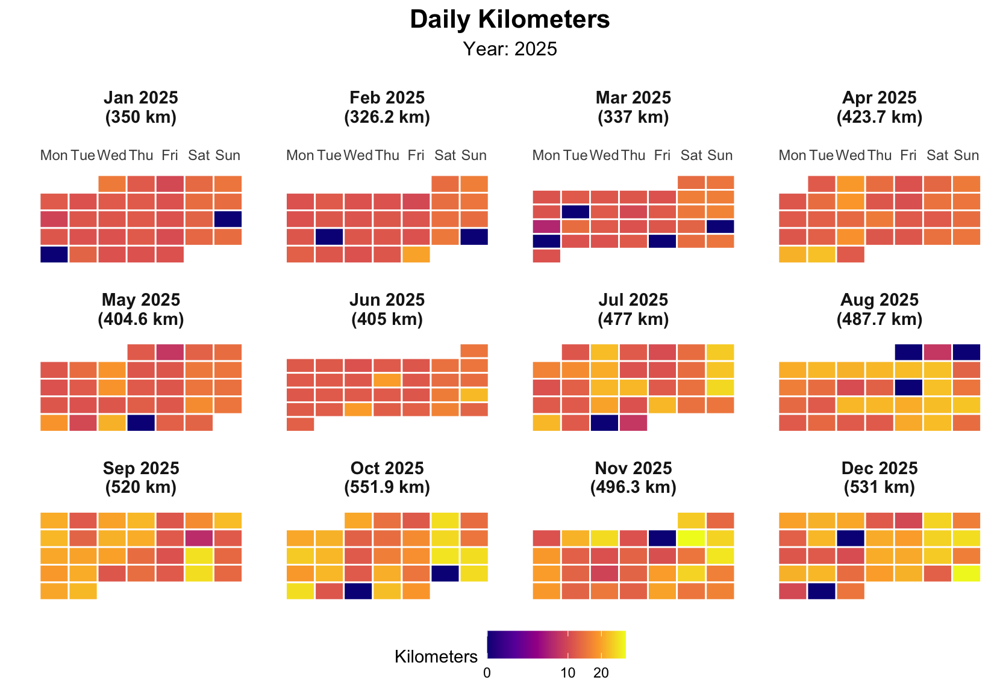

## The loneliness of the long distance runner

I'm not much of a Strava person, and I've never been keen on the apps that upload your training to a social network to share with other runners. Still, I like to keep track of my daily workouts, and I do it the old-fashioned way: a plain Excel file (`running.xlsx`) with one row per day and a column for the kilometers logged.

If you're also into data visualization and work with it professionally, though, a plain spreadsheet is never quite enough — you end up wanting to *see* the training rather than just log it. A calendar heatmap turns out to be a simple but visually powerful way to look at training volume week by week, month by month, across the whole year: darker tiles mean longer runs, lighter tiles mean rest or short recovery days, and the empty gaps are immediately obvious in a way that a spreadsheet row never quite shows.

### Building the heatmap

The script below (`training.R`) reads the `2025` sheet from `running.xlsx`, cleans up the dates and distances, and then lays each day out on a small monthly calendar grid faceted by month. Let's walk through it piece by piece.

**1. Load the libraries and read the log.** Nothing fancy here — `readxl` pulls the spreadsheet in, `dplyr` and `lubridate` do the date wrangling, and `ggplot2` draws the thing.

```{.r filename="training.R"}
library(ggplot2)
library(dplyr)
library(lubridate)
library(scales)
library(readxl)  # For reading Excel files

# Read the Excel file
kms <- read_excel("blog/2026/09/running.xlsx", sheet = "2025")
```

**2. Clean the data and print a quick summary.** Dates get coerced properly, rows with missing values are dropped, and distances are forced to numeric. Nothing here should ever trigger, but a training log accumulated by hand over a year *will* eventually have a typo'd cell.

```{.r filename="training.R"}
kms <- kms %>%
  mutate(date = as.Date(date)) %>%
  filter(!is.na(date), !is.na(kms)) %>%
  mutate(kms = as.numeric(kms)) %>%
  filter(kms >= 0)

cat("Data Summary:\n")
cat("Date range:", as.character(min(kms$date)), "to", as.character(max(kms$date)), "\n")
cat("Total days:", nrow(kms), "\n")
cat("Total kilometers:", sum(kms$kms, na.rm = TRUE), "km\n")
cat("Average daily kilometers:", round(mean(kms$kms, na.rm = TRUE), 2), "km\n")
```

**3. Work out where each day sits on its monthly calendar grid.** `ggplot2` has no built-in calendar geometry, so this is the part that actually earns its keep: for every date we compute its weekday (Monday-first) and its `week_of_month`, correcting for the fact that the 1st of the month rarely falls on a Monday. Each day also gets tagged with that month's running total, which ends up in the facet label.

```{.r filename="training.R"}
create_kms_calendar_heatmap <- function(data, title = "Daily Kilometers Calendar Heatmap") {

  calendar_data_prep <- data %>%
    rename(value = kms)

  monthly_totals <- calendar_data_prep %>%
    mutate(year = year(date), month = month(date)) %>%
    group_by(year, month) %>%
    summarise(total_kms = sum(value, na.rm = TRUE), .groups = 'drop')

  calendar_data <- calendar_data_prep %>%
    mutate(
      year = year(date),
      month = month(date),
      day = day(date),
      weekday = wday(date, week_start = 1), # Monday = 1
      month_name = month(date, label = TRUE, abbr = TRUE)
    ) %>%
    group_by(year, month) %>%
    mutate(
      first_day_of_month = floor_date(date, "month"),
      first_weekday = wday(first_day_of_month, week_start = 1),
      # Offset by how far into the week the 1st of the month falls
      week_of_month = ceiling((day + first_weekday - 1) / 7)
    ) %>%
    ungroup() %>%
    left_join(monthly_totals, by = c("year", "month")) %>%
    mutate(
      month_year_label = paste0(month_name, " ", year, "\n(", round(total_kms, 1), " km)"),
      month_year_date = as.Date(paste(year, month, "01", sep = "-"))
    ) %>%
    arrange(month_year_date)

  month_order <- calendar_data %>%
    select(month_year_label, month_year_date) %>%
    distinct() %>%
    arrange(month_year_date) %>%
    pull(month_year_label)

  calendar_data$month_year_label <- factor(calendar_data$month_year_label, levels = month_order)

  calendar_data
}
```

**4. Draw the tiles.** With the calendar grid in place, the plot itself is a straightforward `geom_tile()` faceted by month, colored on a diverging scale centered on the median distance — so an easy 5K and a 25K long run stand out on opposite ends, and typical training days fade into the gray middle.

```{.r filename="training.R"}
plot_kms_calendar <- function(calendar_data, title = "Daily Kilometers Calendar Heatmap") {
  ggplot(calendar_data, aes(x = weekday, y = -week_of_month, fill = value)) +
    geom_tile(color = "white", linewidth = 0.5) +
    facet_wrap(~ month_year_label, ncol = 4, scales = "free_y") +
    scale_x_continuous(
      breaks = 1:7,
      labels = c("Mon", "Tue", "Wed", "Thu", "Fri", "Sat", "Sun"),
      position = "top"
    ) +
    scale_y_continuous(breaks = NULL) +
    scale_fill_gradient2(
      low = "lightgray", mid = "yellow", high = "darkred",
      midpoint = median(calendar_data$value, na.rm = TRUE),
      name = "Kilometers"
    ) +
    labs(title = title, x = "", y = "") +
    theme_minimal() +
    theme(
      axis.text.y = element_blank(),
      axis.text.x.bottom = element_blank(),
      axis.ticks = element_blank(),
      panel.grid = element_blank(),
      strip.background = element_blank(),
      legend.position = "bottom"
    )
}

kms_calendar_plot <- plot_kms_calendar(create_kms_calendar_heatmap(kms))
print(kms_calendar_plot)
```

**5. A colorblind-friendly variant, and the monthly numbers behind the chart.** Swapping in the `viridis` "plasma" scale is a one-liner. And since the heatmap is meant to replace staring at a spreadsheet, it's only fair to also print the spreadsheet-style summary it's replacing.

```{.r filename="training.R"}
kms_calendar_viridis <- plot_kms_calendar(create_kms_calendar_heatmap(kms), "Daily Kilometers") +
  scale_fill_viridis_c(name = "Kilometers", option = "plasma", trans = "sqrt")
print(kms_calendar_viridis)

monthly_stats <- kms %>%
  mutate(year_month = floor_date(date, "month")) %>%
  group_by(year_month) %>%
  summarise(
    total_kms = sum(kms, na.rm = TRUE),
    avg_daily_kms = mean(kms, na.rm = TRUE),
    max_daily_kms = max(kms, na.rm = TRUE),
    days_with_data = n(),
    .groups = 'drop'
  )

print(monthly_stats)
```

And here's the result for 2025:



The gaps are the honest part of the chart — the weeks I meant to run and didn't are just as visible as the weeks I did. All told, 2025 added up to **5,310 km** — enough to have jogged from Córdoba to Ulaanbaatar, if I'd only picked a less roundabout route than "out my front door and back."
