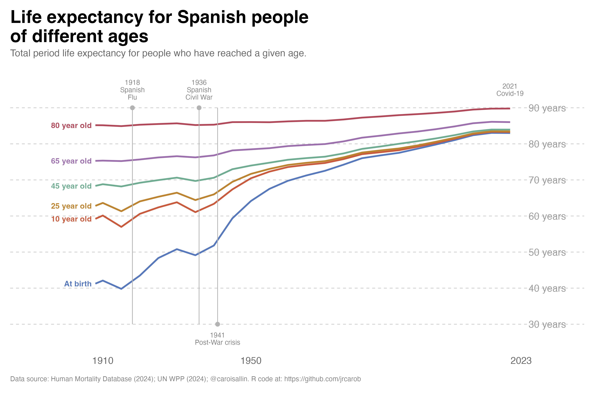

## What is life expectancy?

Based on the [French chart](https://www.reddit.com/r/geography/comments/1onpz0r/life_expectancy_for_french_people_of_different/){target=_blank}, I replicated the most relevant periods where Spanish life expectancy dropped dramatically since the beginning of the last century:



## Beyond the Crises: A Century of Increasing Survival

The most interesting feature of this figure is not the dramatic falls associated with Spain's great mortality crises, but what happens between them. Once the effects of war, famine and epidemics recede, the lines move steadily upward, revealing one of the most profound transformations in modern Spanish history: the progressive extension of life itself.

The figure follows life expectancy not only at birth, but at ages 10, 25, 45, 65 and 80. This distinction is crucial. Life expectancy at birth is strongly influenced by mortality during infancy and childhood, whereas life expectancy conditional on reaching older ages tells us something different: how long people who have already survived to those ages can expect to live. Reading the lines together therefore provides a much richer picture of Spain's mortality transition than a conventional life-expectancy series.

### $\bullet$ The human toll

1. Spanish Flu (1918-1919): The most visible drop in the chart occurs around 1918, corresponding to the global influenza pandemic. This pandemic killed millions worldwide and caused a sharp, sudden decline in life expectancy across all age groups in Spain. 

2. Spanish Civil War (1936-1939): The second major drop occurs around 1936-1939 during Spain's civil war. The conflict, along with associated violence, food shortages, disease, and infrastructure destruction, caused another significant decline in life expectancy. This drop is particularly pronounced for younger age groups ("At birth" and younger adults), as wars typically affect these populations more severely. Between 1940 and 1941, mortality rates increased by more than 20 percent compared to 1935, particularly in southern Spain. The death rate reached 18.7 percent and infant mortality stood at 143 percent. The dip around 1941 represents this tragic convergence of post-war devastation, misguided economic policy, and international isolation that created a genuine famine in Spain.
At least 200,000 people died from hunger or malnutrition-related diseases during the 1940s The most vulnerable groups - wage workers, children, widows, and the elderly - suffered disproportionately. The main causes were:

<!--**Key observation:** Notice how the "At birth" (blue line) shows the most dramatic drops during these crises, while older age groups (like 80-year-olds in dark red) show much smaller fluctuations. This reflects that mortality crises often disproportionately affect infants, children, and young adults, while those who have already survived to old age are somewhat "selected" for resilience.-->

  -  _Franco's autarky policies_: The Francoist authorities instituted a policy of food self-sufficiency involving price regulation and restrictions on transport and food sales.
  - _Allied economic blockade_: Britain and the United States imposed measures to limit imports to Spain due to Franco's pro-German foreign policy during WWII, which exacerbated the existing food supply problems.
  - _Mismanagement and corruption_: The regime's economic policies created a black market economy while official channels failed to provide adequate food distribution.

3. COVID-19 (2020-2021)_: While not as dramatic as the previous two events (and the chart may not show complete data for this period), COVID-19 caused a noticeable decline in life expectancy globally, including in Spain. This was the first significant drop in modern life expectancy after decades of steady improvement.

## The Great Convergence

Perhaps the most striking feature is the gradual convergence of the different age-specific measures. At the beginning of the period, the gap between life expectancy at birth and life expectancy at older ages is enormous. By 2023, however, all the lines have moved substantially upward, and the differences between successive ages are much smaller in absolute terms.

This is the result of a fundamental change in the distribution of mortality across the life course. In the early twentieth century, surviving childhood was itself a major demographic achievement. High infant and child mortality depressed life expectancy at birth, while infectious diseases and poor living conditions continued to expose young and middle-aged adults to substantial mortality risks.

As these risks declined, survival became progressively more common at every stage of life. The demographic revolution was therefore not simply about adding years to the lives of the elderly. It involved moving mortality progressively towards older ages.

## From Survival to Longevity

The blue line, representing life expectancy at birth, tells perhaps the most dramatic story. From a level of around 40 years at the beginning of the twentieth century, it eventually approaches the mid-80s. But interpreting this increase as a simple doubling of the length of human life would be misleading.

Much of the early gain resulted from preventing premature deaths. Improvements in sanitation, nutrition, housing, vaccination, maternal and infant health, antibiotics and public health dramatically reduced mortality at younger ages. As a consequence, increasingly large proportions of each generation survived to adulthood.

Later, the source of mortality improvement changed. Once deaths at young ages became relatively uncommon, further gains increasingly depended on reducing mortality among middle-aged and older adults.

The history visible in the figure is therefore a transition from **survival improvement to longevity improvement**.

## The Revolution at Older Ages

The trajectories for people aged 65 and 80 are particularly revealing. Their gradual upward movement demonstrates that the Spanish longevity revolution did not stop once people reached retirement age.

Someone reaching 65 today can expect considerably more years of life than someone reaching the same age a century ago. The same is true at age 80. This is one of the most consequential developments in contemporary demography because it means that population ageing is being produced by two forces simultaneously: fewer births and increasing survival at older ages.

This distinction matters for interpreting Spain's demographic future. Longer life expectancy at 65 does not merely mean that there will be more elderly people. It means that the elderly themselves are increasingly likely to survive into their seventies, eighties and nineties.

## A Different Kind of Mortality Selection

The figure also illustrates an important demographic principle: **life expectancy depends on who has survived to a given age**.

An 80-year-old in a life table is not equivalent, in mortality terms, to a newborn. The former has already survived the risks that affected mortality earlier in the life course. Consequently, temporary mortality shocks tend to have very different effects depending on age.

This helps explain why the lines for older ages are generally smoother than the line for life expectancy at birth. A mortality crisis can have a large effect on the average number of years expected at birth because it changes the probability of surviving the earliest stages of life. For someone who has already reached 80, however, the relevant population is a highly selected group of survivors.

The figure therefore reminds us that **“life expectancy” is not one single demographic concept**. The expected future lifetime of a newborn and that of a 65-year-old describe different stages of the mortality process.

## The Post-War Turning Point

The sharp deterioration around the early 1940s, which reflects the severe mortality conditions of the post-Civil War period, is particularly important because it interrupts what would otherwise appear to be a relatively smooth long-term improvement.

But the subsequent recovery is perhaps even more revealing than the decline itself. After the extraordinary mortality conditions of the early 1940s, the lines resume their upward trajectory. The temporary shock therefore becomes embedded within a much longer process of mortality decline.

This is an important distinction between **period shocks** and **long-term demographic change**. Epidemics, wars and crises can temporarily reverse mortality improvements, but their effects need not alter the underlying direction of the mortality transition.

## The Recent Plateau Is Not a Demographic Failure

Towards the end of the series, the lines begin to flatten somewhat as they approach historically high levels. This should not necessarily be interpreted as the end of progress.

As mortality becomes concentrated increasingly at very advanced ages, each additional year of life expectancy becomes harder to obtain. Reducing mortality from 20 to 10 deaths per 1,000 at a particular age has a very different demographic effect from reducing it from 2 to 1. The remaining mortality becomes increasingly concentrated among ages where biological ageing itself places stronger constraints on survival.

The future of Spanish longevity will therefore depend increasingly on what happens at the oldest ages. The central question is no longer primarily how to prevent premature death, but whether mortality at advanced ages can continue to be postponed.

## From More Years to Better Years

There is also a deeper question hidden behind the upward movement of these lines. Additional years of life are not necessarily equivalent to additional years of healthy or disability-free life.

If longevity continues to increase, Spain will need to distinguish between simply extending survival and extending **healthy survival**. This distinction will become increasingly important for pensions, healthcare, long-term care and the organisation of working lives.

The rise in life expectancy at 65, in particular, changes the meaning of old age itself. Retirement at 65 followed by two decades or more of additional life is fundamentally different from the demographic conditions under which modern pension systems were originally designed.

## The Century That Changed Spanish Survival

Taken as a whole, the figure tells a remarkable story. Spain moved from a mortality regime in which childhood survival was far from guaranteed to one in which reaching old age has become the norm. The extraordinary gains at younger ages gradually gave way to improvements in adult and elderly survival, producing a population in which living well beyond 80 is increasingly common.

The crises visible in the graph are therefore important, but they are interruptions within a much larger narrative. The dominant story is the upward movement of almost every line.

A century ago, the principal demographic question was whether people would survive. Today, an increasingly important question is **how long they will survive after reaching old age—and what kind of lives those additional years will contain**.

Spain's mortality transition has therefore not simply made life longer. It has fundamentally changed the meaning of age itself.

## Reproducibility: Recreating the Figure in R

```{r setup, include = TRUE, message=FALSE}
knitr::opts_chunk$set(echo = T,
                      results = "hide")
# Load libraries
library(tidyverse)
library(scales)

# 1. READ the file (Year is "1908-1912", not a number)
# ~/Desktop/Omega/00_Projects/01_Paper_Projects/00_ongoing/1stGROUP/demography2/R Codes/MortalityLaws
lt <- read_table("~/Desktop/Phi/site_personal_web/demography/2025_life_expectancy/bltper_1x5.txt", 
                 skip = 2,
                 col_types = cols(
                   Year = col_character(),
                   Age  = col_character(),
                   ex   = col_double(),
                   .default = col_character()
                 )) %>%
  filter(!is.na(ex)) %>%
  mutate(Age = as.numeric(str_remove(Age, "\\+"))) %>%
  mutate(start_year = as.numeric(str_sub(Year, 1, 4))) %>%
  mutate(x = start_year) %>%
  select(x, Age, ex)
```

```{r}
# 2. Filter for the specific age groups
# Important: ex is REMAINING life expectancy, so total = Age + ex
df <- lt %>%
  filter(Age %in% c(0, 10, 25, 45, 65, 80)) %>%
  mutate(
    total_life_exp = Age + ex,  # Total life expectancy
    age_group = case_when(
      Age == 0  ~ "At birth",
      Age == 10 ~ "10 year old",
      Age == 25 ~ "25 year old",
      Age == 45 ~ "45 year old",
      Age == 65 ~ "65 year old",
      Age == 80 ~ "80 year old"
    )
  ) %>%
  mutate(age_group = factor(age_group,
                            levels = c("At birth", "10 year old", "25 year old",
                                       "45 year old", "65 year old", "80 year old")))

# Get the first data point for each age group for label positioning
first_points <- df %>%
  group_by(age_group) %>%
  slice_min(x, n = 1) %>%
  ungroup()
```

Now we can create the plot

```{r plot, eval = FALSE}
# 3. Create the plot
ggplot(df, aes(x = x, y = total_life_exp, color = age_group)) +
  geom_line(linewidth = 1.2) +
  
  # Event markers as lollipops (solid line with dot at top)
  annotate("segment", x = 1918, xend = 1918, y = 30, yend = 90, 
           color = "gray70", linewidth = 0.5) +
  annotate("point", x = 1918, y = 90, color = "gray70", size = 2.5) +
  
  annotate("segment", x = 1936, xend = 1936, y = 30, yend = 90, 
           color = "gray70", linewidth = 0.5) +
  annotate("point", x = 1936, y = 90, color = "gray70", size = 2.5) +
  
  annotate("segment", x = 1941, xend = 1941, y = 30, yend = 90, 
           color = "gray70", linewidth = 0.5) +
  annotate("point", x = 1941, y = 30, color = "gray70", size = 2.5) +
  
  # Event labels
  annotate("text", x = 1918, y = 95, label = "1918\nSpanish\nFlu", 
           size = 3.5, color = "gray50", lineheight = 0.9) +
  annotate("text", x = 1936, y = 95, label = "1936\nSpanish\nCivil War", 
           size = 3.5, color = "gray50", lineheight = 0.9) +
  annotate("text", x = 1941, y = 26, label = "1941\nPost-War crisis", 
           size = 3.5, color = "gray50", lineheight = 0.9) +
  annotate("text", x = 2020, y = 95, label = "2021\nCovid-19", 
           size = 3.5, color = "gray50", lineheight = 0.9) +
  
  # Age group labels at the beginning of each line (using actual first data points)
  geom_text(data = first_points, 
            aes(x = x - 1, y = total_life_exp, label = age_group, color = age_group),
            hjust = 1, fontface = "bold", size = 4, show.legend = FALSE) +
  
  # Y-axis labels on the right
  annotate("text", x = 2025, y = 90, label = "90 years", 
           color = "gray60", size = 5, hjust = 0) +
  annotate("text", x = 2025, y = 80, label = "80 years", 
           color = "gray60", size = 5, hjust = 0) +
  annotate("text", x = 2025, y = 70, label = "70 years", 
           color = "gray60", size = 5, hjust = 0) +
  annotate("text", x = 2025, y = 60, label = "60 years", 
           color = "gray60", size = 5, hjust = 0) +
  annotate("text", x = 2025, y = 50, label = "50 years", 
           color = "gray60", size = 5, hjust = 0) +
  annotate("text", x = 2025, y = 40, label = "40 years", 
           color = "gray60", size = 5, hjust = 0) +
  annotate("text", x = 2025, y = 30, label = "30 years", 
           color = "gray60", size = 5, hjust = 0) +
  
  # Scales
  scale_x_continuous(breaks = c(1910, 1950, 2023),
                     #labels = c("1910", "1950", "2023"),
                     limits = c(1885, 2040),
                     #sequence(1900, 2025, by = 10),
                     expand = c(0, 0)) +
  scale_y_continuous(limits = c(22, 99.9),
                     breaks = seq(30, 90, 10),
                     expand = c(0, 0)) +
  
  # Color scheme matching the chart
  scale_color_manual(values = c(
    "At birth"    = "#5778bb",
    "10 year old" = "#c85b3e",
    "25 year old" = "#bc8331",
    "45 year old" = "#6fac91",
    "65 year old" = "#9c70ad",
    "80 year old" = "#b04959"
  )) +
  
  # Labels
  labs(title = "Life expectancy for Spanish people\nof different ages",
       subtitle = "Total period life expectancy for people who have reached a given age.",
       x = NULL,
       y = NULL,
       caption = "Data source: Human Mortality Database (2024); UN WPP (2024); @caroisallin. R code at: https://github.com/jrcarob") +
  # Theme
  theme_minimal(base_size = 13) +
  theme(
    plot.title = element_text(size = 26, face = "bold", hjust = 0, 
                              margin = margin(b = 5), family = "sans"),
    plot.subtitle = element_text(size = 14, hjust = 0, color = "gray40",
                                 margin = margin(b = 20)),
    legend.position = "none",
    panel.grid.major.y = element_line(color = "gray80", linewidth = 0.5, linetype = "dashed"),
    panel.grid.major.x = element_blank(),
    panel.grid.minor = element_blank(),
    axis.text.y = element_blank(),
    axis.text.x = element_text(color = "gray40", size = 14),
    axis.ticks.x = element_blank(),
    plot.caption = element_text(size = 10, color = "gray50", hjust = 0,
                                margin = margin(t = 15)),
    plot.margin = margin(15, 10, 15, 15),
    plot.background = element_rect(fill = "white", color = NA),
    panel.background = element_rect(fill = "white", color = NA)
  )
```

Finally we can save the plot in .png format directly in our working directory

```{r save, eval = FALSE}
# Save the plot
ggsave("life_expectancy_spain.png", width = 12, height = 8, dpi = 300, bg = "white")
```
