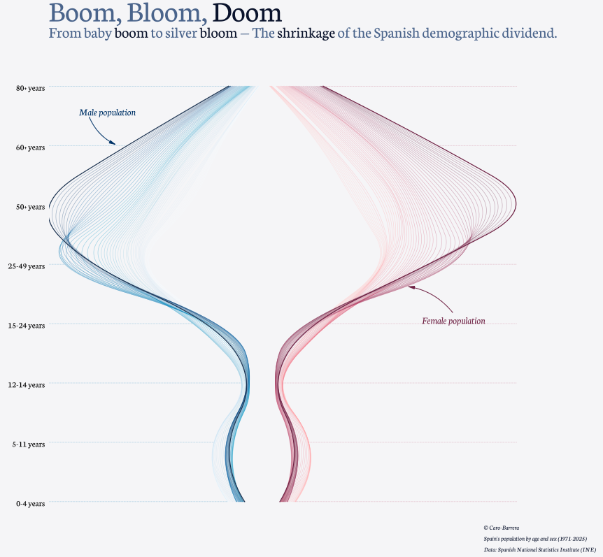

## The Shrinking of Spain's Demographic Dividend

Few demographic transformations are as striking as the one represented in this figure. The graphic traces the changing age structure of Spain’s population through time, separating men and women and following the successive generations as they move upwards through the life course. Its elegant shape tells a story that is ultimately about numbers, but also about the changing social and economic foundations of Spanish society.

The title, **“Boom, Bloom, Doom,”** captures three stages of this transformation. The *boom* represents the large generations that entered the population during periods of relatively high fertility. The *bloom* reflects their progression into adulthood and, later, older age. The *doom* is not a prediction of demographic collapse, but a provocative reference to what happens when these large generations reach old age while the cohorts following them are considerably smaller.

## The Vanishing Base of the Population Pyramid

The most immediately visible feature is the progressive narrowing of the youngest age groups. At the bottom of the figure, the cohorts aged 0–4 and 5–11 are relatively narrow compared with the much wider bands occupied by older generations. This is the visual signature of sustained low fertility.

The contrast becomes particularly pronounced around adolescence and young adulthood. The population structure is no longer a pyramid with a broad base supporting progressively smaller generations. Instead, it resembles an hourglass: relatively small numbers of children, large concentrations in middle and older ages, and an increasingly prominent elderly population.

This is perhaps the central demographic challenge facing Spain. Low fertility does not simply reduce the number of births in one year. Once sustained over decades, it progressively reduces the size of the generations that will become tomorrow's workers, parents and contributors to the social protection system.

## The Baby Boom Moves Through Time

The broadest part of the figure represents the large generations born during Spain's higher-fertility decades. What is particularly interesting is that these generations do not disappear as they age; they move through the demographic structure.

A large cohort that was once visible among children subsequently appears among young adults, then among the working-age population, and eventually among older people. The figure therefore allows us to see population ageing not as a sudden event, but as a process of demographic inertia.

This is why demographic change can continue for decades even after fertility patterns have changed. Population structures have memory. Today's age distribution is partly the consequence of decisions and demographic circumstances experienced many decades ago.

## From Demographic Dividend to Demographic Burden?

The concept of the **demographic dividend** traditionally refers to the economic opportunity created when the working-age population becomes relatively large compared with children and older dependants. Spain benefited from such favourable demographic conditions as large generations entered working age.

But the same demographic mechanism eventually operates in reverse.

Those large working-age cohorts are now moving towards retirement and old age, while the generations behind them are considerably smaller. The result is a shrinking ratio between the population of working ages and the population requiring pensions, healthcare and long-term care.

The figure therefore suggests a transition from a demographic dividend towards what might be called a **demographic balance-sheet problem**: the generations that once contributed to population growth and economic expansion are becoming the generations that require increasing amounts of social and healthcare expenditure.

## The Growing Importance of the Silver Population

The upper part of the figure is perhaps its most consequential feature. The trajectories widen substantially at older ages, particularly beyond 60 and 80 years. This reflects the accumulation of large cohorts combined with improvements in survival.

The ageing of Spain's population should therefore not be interpreted simply as the disappearance of younger people. It is the simultaneous result of **fewer births and longer lives**.

This distinction matters. A society can become older because it produces fewer children, because people live longer, or because both processes occur simultaneously. Spain has experienced both. Consequently, population ageing is likely to remain a defining characteristic of the country's demographic landscape even if fertility were to recover.

## Why the Female Side Matters

The asymmetry between the male and female sides of the figure becomes increasingly visible at older ages. Women form a larger share of the oldest population because of their historically higher survival.

This has important consequences that are sometimes overlooked in discussions of population ageing. Very old populations are increasingly female populations, and this affects patterns of widowhood, living arrangements, pension adequacy, dependency and the demand for long-term care.

The demographic future is therefore not simply older. It is also increasingly characterised by very old women living in the final stages of the life course.

## The Shrinking Demographic Dividend

The figure ultimately tells a story about the changing demographic foundations of Spain. The country has moved from a period in which relatively large generations entered adulthood and working age to one in which those same generations are progressively approaching retirement and advanced old age.

At the same time, the cohorts replacing them are smaller.

That combination is crucial. The challenge is not that Spain will suddenly run out of people. Rather, the **composition of the population is changing in a way that reduces the relative weight of the working-age population and increases the weight of older ages**.

The demographic dividend therefore does not disappear overnight. It gradually shrinks as the population moves from a favourable age structure towards one dominated by older generations.

## Demography Has a Long Memory

Perhaps the most important lesson of the graph is that demographic change cannot be understood by looking only at today's birth rate or today's population size. Population structures carry the imprint of the past.

The children born decades ago are today's workers and retirees. The small cohorts being born today will become tomorrow's labour force and parents. What Spain looks like in 2050 or 2060 is therefore already partly encoded in the age structure visible today.

This makes the graph more than an attractive visualisation. It is a reminder that demographic processes operate slowly, accumulate over generations and are extraordinarily difficult to reverse.

**Spain's demographic dividend once came from large generations moving into working age. Its next demographic chapter will be written as those same generations move into retirement and advanced old age. The question is no longer whether this transition will occur, but how successfully Spanish institutions and the economy will adapt to it.**
