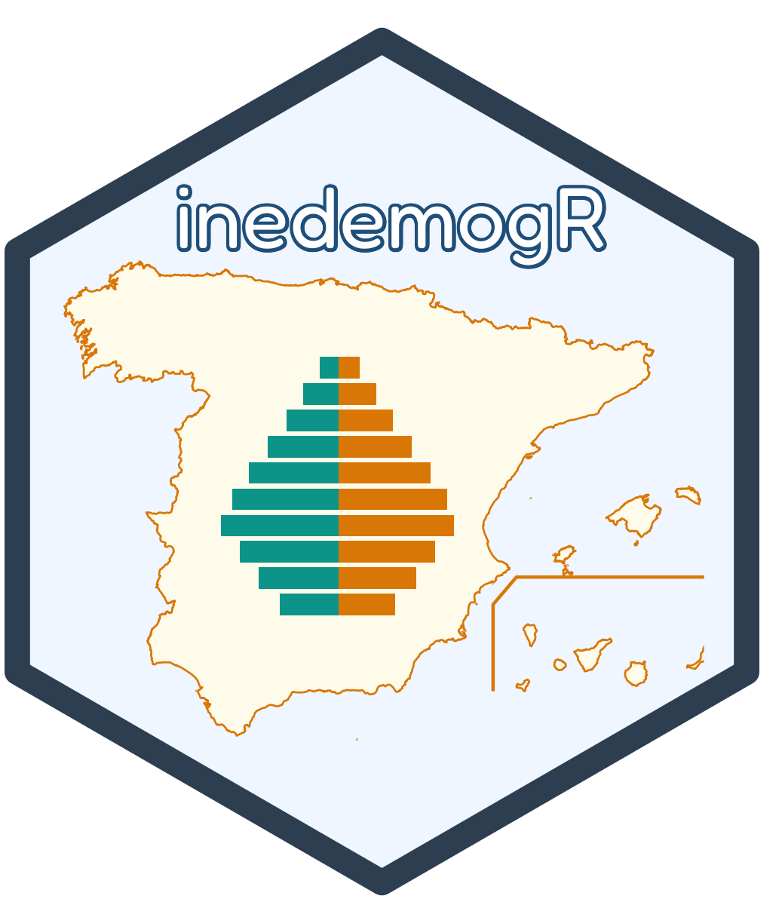

## The R package {width=125} 


### Introduction

The R package `inedemogR` provides tidy access to demographic data from the Spanish National Statistics Institute (INE), specifically its "fenómenos demográficos" domain: population, births, and deaths. Data is retrieved live via the official `ineapir` API wrapper and tidied into long/wide data frames, with optional spatial integration via `mapSpain` and `sf`.

### Installation

`inedemogR` is on [CRAN](https://cran.r-project.org/web/packages/inedemogR/index.html). Install the released version with:

``` r
install.packages("inedemogR")
```

Alternatively, you can install the development version of inedemogR from
[GitHub](https://github.com/jrcarob/inedemogR_package){target="_blank"} with:

``` r
# install.packages("devtools")
pak::pak('jrcarob/inedemogR_package')
or 
devtools::install_github("jrcarob/inedemogR_package")
```

### Citation

If you use this package for your research, please cite:

<div style="background-color: #fae5be; padding: 4px; border-left: 1px solid #F5AD27;">
> Caro-Barrera, J. R. (2026). inedemogR: Tidy Access to Spanish INE Demographic Data. R package version 0.1.0. https://CRAN.R-project.org/package=inedemogR

</div>


