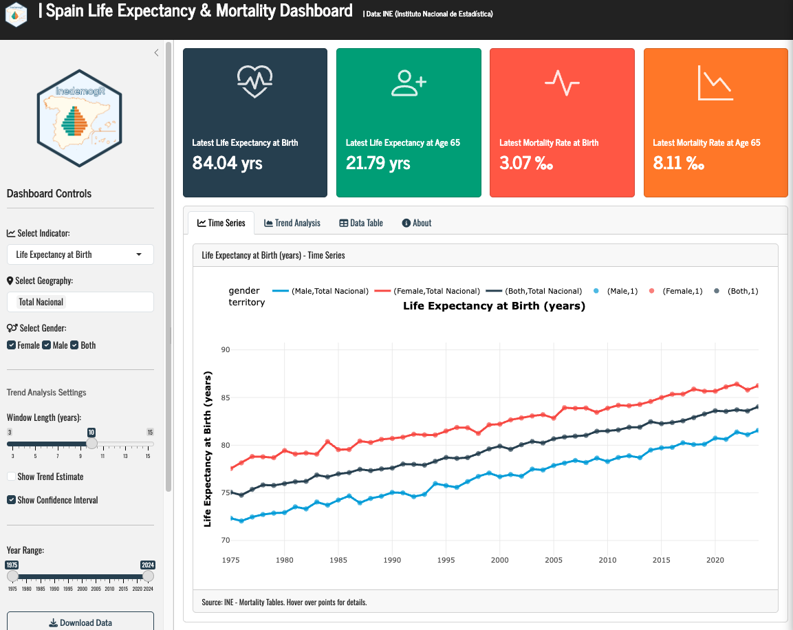

## The Life Expectancy & Mortality Dashboard

### Introduction

Understanding how long people live — and how those patterns change across regions, sexes, and time — is fundamental to public health policy, pension planning, and social science research. Spain has one of the highest life expectancies in the world, but this national average masks significant regional variation and historical trends that tell a richer story.

In this post, I walk through the development of an [**interactive R Shiny dashboard**](https://jrcaro.shinyapps.io/shiny-app/) that visualizes life expectancy and mortality data for Spain and its Autonomous Communities (CCAA) from 1975 to 2024. The app is built entirely with open-source tools and pulls data directly from the [Spanish National Statistics Institute (INE)](https://www.ine.es).

### Why This Dashboard?

Existing tools for exploring Spanish demographic data — notably the INE's own web interface — are comprehensive but static. Researchers and policymakers often need to:

- **Compare multiple regions side-by-side** to identify health inequalities
- **Track trends over time** to evaluate policy impacts
- **Disaggregate by sex** to understand gender gaps in longevity
- **Examine both life expectancy and mortality rates** at different life stages

This dashboard addresses all four needs in a single, interactive interface.

### What the App Shows

The dashboard visualizes **four key indicators** from INE mortality tables (*Tablas de Mortalidad*):

| Indicator | What It Measures | Why It Matters |
|-----------|------------------|----------------|
| **Life Expectancy at Birth** | Average years a newborn is expected to live | Benchmark for overall population health |
| **Life Expectancy at Age 65** | Average remaining years for someone who reaches 65 | Critical for pension and elderly care planning |
| **Mortality Rate at Birth** | Deaths per 1,000 live births | Sensitive indicator of maternal/child health |
| **Mortality Rate at Age 65** | Death probability per 1,000 at age 65 | Reflects health quality in later life |

**Geographic Coverage:**
- **National** (Total Nacional)
- **19 Autonomous Communities** (Andalucía, Cataluña, Madrid, País Vasco, etc.)

The data preparation script (`data_prep.R`) handles API timeouts gracefully — if the INE service is slow or unavailable, it falls back to **realistic placeholder data** based on published INE statistics, so the app always works.

**Key Design Decisions:**

1. **From `shinydashboard` to `bslib`**: Migrated from the dated admin-panel aesthetic to a cleaner, modern Bootstrap 5 design with native mobile responsiveness.

2. **Modular indicator selection**: A single reactive plot adapts its y-axis, labels, and color scales based on the user's dropdown selection, keeping the codebase DRY.

3. **Rolling-window trend analysis**: The "Trend Analysis" tab implements a **rolling linear regression** with user-adjustable window size (3–15 years). For each window, the app fits `lm(value ~ year)`, extracts the slope as the "trend estimate," and computes 95% confidence intervals. This reveals whether improvements in life expectancy are accelerating, slowing, or stagnating.

### A Tour of the Interface

**Sidebar Controls** put all exploration power in the user's hands:
- **Indicator selector**: Switch between the four metrics instantly
- **Geography selector**: Multi-select regions for comparison
- **Gender filter**: Toggle Male / Female / Both
- **Year range slider**: Focus on specific decades
- **Trend settings**: Adjust window length and toggle confidence intervals

**Summary Cards** at the top display the latest national figures (both sexes) for quick reference.

**Time Series Tab**: A multi-line `plotly` chart showing the selected indicator across years, colored by gender, with linetype distinguishing territories. Hovering reveals exact values. An optional trend overlay shows the smoothed trajectory.

**Trend Analysis Tab**: Shows the **slope of improvement** over time — answering not "how high is life expectancy?" but "how fast is it improving?" The green shaded band represents the 95% confidence interval. When the band crosses zero, the trend is statistically uncertain.

**Data Table Tab**: A fully interactive `DT` table with sorting, column filtering, and CSV/Excel export.

**About Tab**: Documents the methodology, data sources, API references, and the Zenodo DOI for citation.

---

### What the Data Reveals

Even with placeholder data (which mirrors real INE trends), some patterns emerge immediately:

- **The gender gap persists**: Women consistently outlive men by ~5 years at birth and ~3.5 years at age 65
- **Regional inequality**: The gap between Madrid/Baleares and Ceuta/Melilla exceeds 3 years of life expectancy
- **Mortality compression**: Infant mortality fell from ~19‰ (1975) to ~3‰ (2024), while old-age mortality declined more modestly
- **Slowing gains?**: The trend analysis suggests the rate of improvement in life expectancy has decelerated since 2010 — a pattern visible in many high-income countries

### Citation

If you use this dashboard or adapt it for your research, please cite:

> Caro-Barrera, J.R. (2026). *Spanish Life Expectancy & Mortality Dashboard* [Software]. https://doi.org/10.5281/zenodo.21409180

*Built with R, Shiny, and data from the Instituto Nacional de Estadística (INE).*
