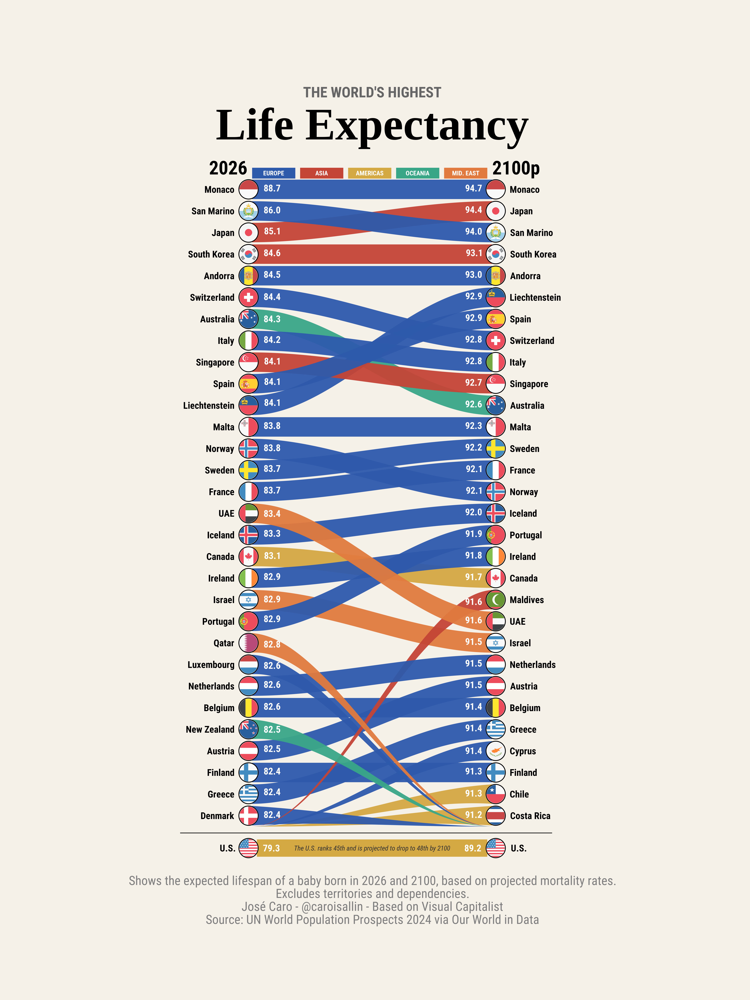

## When 90 Becomes the New Normal




### A Century of Increasing Longevity

The graph offers a striking glimpse of how the geography of longevity could change over the course of the twenty-first century. It compares life expectancy at birth in 2026 with projected levels for 2100, and its most important message is not simply that people are expected to live longer, but that the hierarchy of the world’s longest-lived populations is likely to change considerably.

In 2026, Monaco stands clearly at the top, with a life expectancy of 88.7 years, followed by San Marino, Japan, South Korea and Andorra. The concentration of countries with exceptionally high longevity in Europe and East Asia is remarkable. Spain, Switzerland, Italy and Singapore are also among the current leaders, with life expectancy already exceeding 84 years. These figures illustrate the extraordinary demographic transformation experienced by advanced societies during the last century, driven by improvements in nutrition, living conditions, public health, medical technology and, particularly, the dramatic reduction of mortality at older ages.

### The Geography of Longevity Is Changing

The picture becomes even more interesting when we move towards 2100. Monaco is projected to remain at the top, but with life expectancy approaching 95 years. Japan, San Marino and South Korea also remain among the leaders, while several European countries continue to occupy prominent positions. Spain is particularly noteworthy: from 84.1 years in 2026, it is projected to reach approximately 92.9 years by 2100, placing it among the world's longevity leaders. This is consistent with Spain's longstanding position as one of the countries with the highest life expectancies in the world.

The flows in the graph tell a more subtle story than a simple ranking. Some countries move upward relative to their current position, while others are overtaken despite achieving substantial gains in absolute longevity. This distinction is important. A country can add eight or nine years to life expectancy and nevertheless fall in the ranking if other countries improve even faster. The Sankey design makes this relative dimension immediately visible: longevity is not a race against a fixed benchmark, but a constantly moving distribution in which countries are compared with one another.

### When Living Beyond 90 Becomes Normal

Perhaps the most striking feature of the projection is the emergence of a world in which life expectancy above 90 years is no longer confined to a handful of exceptional populations. By 2100, a growing group of countries is projected to approach or exceed this threshold.

This would represent a profound demographic transformation. Adding several years to average life expectancy is not merely a statistical achievement. It changes the age structure of populations and increases the proportion of people reaching very advanced ages. The implications extend to healthcare, long-term care, pension systems, labour markets, saving behaviour and the organisation of family life.

The crucial question, therefore, is not simply whether people will live longer, but whether institutions will adapt to these longer lives.

### The United States: Longer Lives, but Not a Higher Ranking

The United States provides an especially interesting contrast. Life expectancy rises from 79.3 years in 2026 to 89.2 years in 2100, an extraordinary improvement of almost ten years. Nevertheless, its position remains comparatively modest: the United States is shown around 45th today and only around 48th in 2100.

The message is therefore not that Americans will fail to live substantially longer. Rather, other populations are projected to experience comparable or even greater improvements. The ranking illustrates an important demographic principle: **absolute progress and relative position are not the same thing**.

A country can achieve remarkable improvements in survival while simultaneously losing ground relative to countries experiencing even faster gains.

### What Does a World of Longer Lives Mean?

The demographic consequences of this transformation extend far beyond life expectancy itself. Longer lives imply longer periods of retirement, greater demand for health and long-term care, changing patterns of saving and wealth accumulation, and a fundamental reconsideration of the relationship between working life and old age.

This is particularly important for pension systems. If people live substantially longer but retirement ages remain unchanged, the period during which pensions must be paid becomes progressively longer. One possible response is to extend working lives, but this raises questions about employment, health, inequality and the ability of different occupational groups to remain economically active at older ages.

Longevity should therefore be understood not simply as a demographic success, but as a structural transformation with economic and social consequences.

### 2100 Is a Projection, Not a Prediction

There is, however, an important qualification. These figures are projections, not predictions carved in stone. They depend on assumptions about future mortality trends, and the further we look into the future, the greater the uncertainty surrounding any demographic projection.

The value of the graph therefore lies less in treating 2100 as a precise destination than in using it to understand the direction of demographic change. The exact ranking of countries may look very different by the end of the century, but the broader trend towards longer lives is likely to remain one of the defining demographic developments of our time.

### A New Demographic Frontier

Seen in this way, the graph tells a compelling story. The great demographic achievement of the twentieth century was the extension of human survival; the defining demographic challenge of the twenty-first may be learning how to organise societies in which living into one's nineties becomes increasingly normal.

The question is no longer simply whether humanity will live longer. It is how economies, pension systems, healthcare institutions and societies will adapt to lives that are becoming longer than previous generations could have imagined.

The future of longevity is therefore not only a question of **how many years we gain**, but of **what we do with those additional years**.

## Reproducibility: Recreating the Figure in R

The figure can be reproduced from the underlying demographic data using R. Making the code available alongside the visualisation turns the graph from a static illustration into a reproducible research object, allowing readers to inspect the data, modify the assumptions and experiment with alternative representations of the projected changes in longevity.


The chart is a **Sankey-style ranking flow**: two vertical axes, one for 2026 and one for 2100, with a coloured ribbon connecting each country's position in the two years. The vertical axis is rank (not the life-expectancy value itself), so an upward-sloping ribbon means a country climbs the table and a downward-sloping one means it is overtaken. Regions are encoded by colour, the printed numbers are the actual life-expectancy values at each end, and countries that leave or enter the top 30 get tapering ribbons that fade in or out at the bottom.

Everything below reproduces that figure. Only the data-loading and preparation chunks are executed on render; the plotting and saving chunks are shown but not run (`eval = FALSE`), since the published PNG was produced once at high resolution.

### Setup and data

We start with the packages, a web font, and the two source tables. `ggflags` draws the circular country flags used as nodes; `showtext` lets us use *Roboto Condensed* from Google Fonts. The data are the top 30 countries by life expectancy at birth in each year (plus the United States, carried along as a reference case), taken from the UN *World Population Prospects 2024* via Our World in Data.

```{r setup, include = TRUE, message=FALSE}
knitr::opts_chunk$set(echo = TRUE, results = "hide")
library(tidyverse)

# Plotting-only dependencies (needed for the eval = FALSE chunks below):
#   library(ggflags)   # circular flag glyphs for the nodes
#   library(showtext)  # Google Fonts in ggplot
#   font_add_google("Roboto Condensed", "roboto_condensed"); showtext_auto()

# ============================================================================
# 1. DATA
# ============================================================================

# One colour per world region, reused for ribbons and the legend swatches
region_colors <- c(
  "Europe"    = "#2E5AAC",
  "Asia"      = "#C44536", 
  "Americas"  = "#D4A843",
  "Oceania"   = "#3AA688",
  "Mid. East" = "#E07A3E"
)

country_iso2 <- c(
  "Monaco" = "mc", "San Marino" = "sm", "Japan" = "jp", 
  "South Korea" = "kr", "Andorra" = "ad", "Switzerland" = "ch",
  "Australia" = "au", "Italy" = "it", "Singapore" = "sg",
  "Spain" = "es", "Liechtenstein" = "li", "Malta" = "mt",
  "Norway" = "no", "Sweden" = "se", "France" = "fr",
  "UAE" = "ae", "Iceland" = "is", "Canada" = "ca",
  "Ireland" = "ie", "Israel" = "il", "Portugal" = "pt",
  "Qatar" = "qa", "Luxembourg" = "lu", "Netherlands" = "nl",
  "Belgium" = "be", "New Zealand" = "nz", "Austria" = "at",
  "Finland" = "fi", "Greece" = "gr", "Denmark" = "dk",
  "U.S." = "us", "Maldives" = "mv", "Cyprus" = "cy",
  "Chile" = "cl", "Costa Rica" = "cr"
)

data_2026 <- tribble(
  ~rank_2026, ~country_2026, ~value_2026, ~region_2026,
  1,  "Monaco",        88.7, "Europe",
  2,  "San Marino",    86.0, "Europe",
  3,  "Japan",         85.1, "Asia",
  4,  "South Korea",   84.6, "Asia",
  5,  "Andorra",       84.5, "Europe",
  6,  "Switzerland",   84.4, "Europe",
  7,  "Australia",     84.3, "Oceania",
  8,  "Italy",         84.2, "Europe",
  9,  "Singapore",     84.1, "Asia",
  10, "Spain",         84.1, "Europe",
  11, "Liechtenstein", 84.1, "Europe",
  12, "Malta",         83.8, "Europe",
  13, "Norway",        83.8, "Europe",
  14, "Sweden",        83.7, "Europe",
  15, "France",        83.7, "Europe",
  16, "UAE",           83.4, "Mid. East",
  17, "Iceland",       83.3, "Europe",
  18, "Canada",        83.1, "Americas",
  19, "Ireland",       82.9, "Europe",
  20, "Israel",        82.9, "Mid. East",
  21, "Portugal",      82.9, "Europe",
  22, "Qatar",         82.8, "Mid. East",
  23, "Luxembourg",    82.6, "Europe",
  24, "Netherlands",   82.6, "Europe",
  25, "Belgium",       82.6, "Europe",
  26, "New Zealand",   82.5, "Oceania",
  27, "Austria",       82.5, "Europe",
  28, "Finland",       82.4, "Europe",
  29, "Greece",        82.4, "Europe",
  30, "Denmark",       82.4, "Europe",
  45, "U.S.",          79.3, "Americas",
  
)

data_2100 <- tribble(
  ~rank_2100, ~country_2100, ~value_2100, ~region_2100,
  1,  "Monaco",              94.7, "Europe",
  2,  "Japan",               94.4, "Asia",
  3,  "San Marino",          94.0, "Europe",
  4,  "South Korea",         93.1, "Asia",
  5,  "Andorra",             93.0, "Europe",
  6,  "Liechtenstein",       92.9, "Europe",
  7,  "Spain",               92.9, "Europe",
  8,  "Switzerland",         92.8, "Europe",
  9,  "Italy",               92.8, "Europe",
  10, "Singapore",           92.7, "Asia",
  11, "Australia",           92.6, "Oceania",
  12, "Malta",               92.3, "Europe",
  13, "Sweden",              92.2, "Europe",
  14, "France",              92.1, "Europe",
  15, "Norway",              92.1, "Europe",
  16, "Iceland",             92.0, "Europe",
  17, "Portugal",            91.9, "Europe",
  18, "Ireland",             91.8, "Europe",
  19, "Canada",              91.7, "Americas",
  20, "Maldives",            91.6, "Asia",
  21, "UAE",                 91.6, "Mid. East",
  22, "Israel",              91.5, "Mid. East",
  23, "Netherlands",         91.5, "Europe",
  24, "Austria",             91.5, "Europe",
  25, "Belgium",             91.4, "Europe",
  26, "Greece",              91.4, "Europe",
  27, "Cyprus",              91.4, "Europe",
  28, "Finland",             91.3, "Europe",
  29, "Chile",               91.3, "Americas",
  30, "Costa Rica",          91.2, "Americas",
  48, "U.S.",                89.2, "Americas"
)
```

### From ranks to ribbon geometry

The plot has no real coordinate system of its own: we draw it in an abstract space where `x` runs from 0 (the 2026 axis) to 1 (the 2100 axis) and `y` is a vertical slot derived from rank. Rank 1 sits at the top, so we flip it with `y = 31 - rank`. We then split the countries into three groups — those present in both years (`common`), those that fall out of the top 30 by 2100 (`dropped`), and those that break into it (`new`).

```{r prep, include = TRUE}
# Vertical slot for each country: rank 1 → top of the panel
data_2026_y <- data_2026 |>
  mutate(y_2026 = 31 - rank_2026, iso2 = country_iso2[country_2026])
data_2100_y <- data_2100 |>
  mutate(y_2100 = 31 - rank_2100, iso2 = country_iso2[country_2100])

common_countries  <- intersect(data_2026$country_2026, data_2100$country_2100)
dropped_countries <- setdiff(data_2026$country_2026,  data_2100$country_2100)
new_countries     <- setdiff(data_2100$country_2100,  data_2026$country_2026)

bottom_y     <- 0.5    # where fading ribbons enter/leave
ribbon_width <- 0.9    # thickness of a full ribbon, in y units
```

Each ribbon is a smooth band between a start slot and an end slot. `create_spline()` interpolates the centre-line with a **smoothstep** easing (`3t² − 2t³`), which has zero slope at both ends so ribbons leave and arrive horizontally instead of at an angle. `geom_ribbon()` later needs a lower and an upper edge, so we carry `ymin`/`ymax` a half-width above and below that centre-line.

```{r ribbons, include = TRUE}
create_spline <- function(y_start, y_end, n = 200) {
  t <- seq(0, 1, length.out = n)
  tibble(x = t,
         y = y_start + (y_end - y_start) * (3 * t^2 - 2 * t^3))
}

# --- Common countries: constant-width band between the two slots ---
common_data <- data_2026_y |>
  filter(country_2026 %in% common_countries) |>
  inner_join(data_2100_y |> filter(country_2100 %in% common_countries),
             by = c("country_2026" = "country_2100")) |>
  rename(country = country_2026, region = region_2026) |>
  select(country, y_2026, y_2100, value_2026, value_2100, region, iso2 = iso2.x)

ribbon_common <- map_dfr(seq_len(nrow(common_data)), function(i) {
  row <- common_data[i, ]
  create_spline(row$y_2026, row$y_2100) |>
    mutate(country = row$country, region = row$region, iso2 = row$iso2,
           ymin = y - ribbon_width / 2, ymax = y + ribbon_width / 2)
})

# --- Dropped / new: same centre-line, but width tapered to zero at the ---
#     open end so the ribbon visually "fades out" (dropped) or "fades in" (new)
taper_ribbon <- function(dat, direction = c("out", "in")) {
  direction <- match.arg(direction)
  map_dfr(seq_len(nrow(dat)), function(i) {
    row <- dat[i, ]
    t <- seq(0, 1, length.out = 200)
    w <- if (direction == "out") (1 - t)^1.5 else t^1.5   # width factor
    half <- (ribbon_width / 2) * w
    y <- row$y_2026 + (row$y_2100 - row$y_2026) * (3 * t^2 - 2 * t^3)
    tibble(x = t, y = y, country = row$country, region = row$region,
           iso2 = row$iso2, ymin = y - half, ymax = y + half)
  })
}

dropped_data <- data_2026_y |>
  filter(country_2026 %in% dropped_countries) |>
  mutate(y_2100 = bottom_y, value_2100 = NA_real_) |>
  rename(country = country_2026, region = region_2026) |>
  select(country, y_2026, y_2100, value_2026, value_2100, region, iso2)

new_data <- data_2100_y |>
  filter(country_2100 %in% new_countries) |>
  mutate(y_2026 = bottom_y, value_2026 = NA_real_) |>
  rename(country = country_2100, region = region_2100) |>
  select(country, y_2026, y_2100, value_2026, value_2100, region, iso2)

ribbon_dropped <- taper_ribbon(dropped_data, "out")
ribbon_new     <- taper_ribbon(new_data, "in")

ribbon_all <- bind_rows(ribbon_common, ribbon_dropped, ribbon_new)
```

### Edge labels and nodes

The life-expectancy values are printed just inside each end of the ribbon. We sample the same smoothstep curve slightly away from the axis (`t = 0.07` and `t = 0.93`) so the number sits on the ribbon rather than under the flag. Dropped countries only get a left-hand (2026) value; new countries only get a right-hand (2100) one.

```{r labels, include = TRUE}
calc_spline_y <- function(y_start, y_end, t) {
  y_start + (y_end - y_start) * (3 * t^2 - 2 * t^3)
}
fmt_value <- function(v) ifelse(is.na(v), "", sprintf("%.1f", v))

left_values_all <- bind_rows(
  common_data  |> mutate(x_pos = 0.07,
                         y_pos = calc_spline_y(y_2026, y_2100, 0.07),
                         label_text = fmt_value(value_2026)),
  dropped_data |> mutate(x_pos = 0.07,
                         y_pos = calc_spline_y(y_2026, y_2100, 0.07),
                         label_text = fmt_value(value_2026))
)
right_values_all <- bind_rows(
  common_data |> mutate(x_pos = 0.93, y_pos = y_2100,
                        label_text = fmt_value(value_2100)),
  new_data    |> mutate(x_pos = 0.93,
                        y_pos = calc_spline_y(y_2026, y_2100, 0.93),
                        label_text = fmt_value(value_2100))
)

# Node = white circle + flag glyph at each country's slot on its axis
nodes_2026_all <- data_2026_y |>
  transmute(country = country_2026, value_2026, node_y = y_2026,
            region = region_2026, iso2, x = 0)
nodes_2100_all <- data_2100_y |>
  transmute(country = country_2100, value_2100, node_y = y_2100,
            region = region_2100, iso2, x = 1)
```

### Assembling the plot

The figure is built in layer order: ribbons first, then the printed values on top of them, then the flag nodes and country names on each axis, and finally the title block, the region colour key, the detached United States row at the bottom, and the source notes. `coord_equal(ratio = 0.09)` locks the aspect ratio so the flag circles stay round, and `theme_void()` strips every axis and grid line — none of the abstract `x`/`y` space is meant to be read directly.

```{r plot, eval = FALSE}
library(ggflags)
library(showtext)
font_add_google("Roboto Condensed", "roboto_condensed")
showtext_auto()

bg_color <- "#F5F0E8"

p <- ggplot() +
  # --- ribbons, coloured by region ---
  geom_ribbon(data = ribbon_all,
              aes(x = x, ymin = ymin, ymax = ymax, group = country, fill = region),
              alpha = 0.95, color = NA) +
  scale_fill_manual(values = region_colors, name = NULL) +

  # --- life-expectancy values at each end of every ribbon ---
  geom_text(data = left_values_all,
            aes(x = x_pos, y = y_pos, label = label_text),
            size = 18, fontface = "bold", color = "white",
            family = "roboto_condensed", vjust = 0.3, hjust = 0.3) +
  geom_text(data = right_values_all,
            aes(x = x_pos, y = y_pos, label = label_text),
            size = 18, fontface = "bold", color = "white",
            family = "roboto_condensed", vjust = 0.3, hjust = 0.6) +

  # --- nodes: white disc + flag, on the 2026 axis and the 2100 axis ---
  geom_point(data = nodes_2026_all, aes(x = x - 0.015, y = node_y),
             size = 15, color = "black", fill = "white", shape = 21, stroke = 1) +
  ggflags::geom_flag(data = nodes_2026_all,
                     aes(x = x - 0.015, y = node_y, country = iso2), size = 13) +
  geom_point(data = nodes_2100_all, aes(x = x + 0.015, y = node_y),
             size = 15, color = "black", fill = "white", shape = 21, stroke = 1) +
  ggflags::geom_flag(data = nodes_2100_all,
                     aes(x = x + 0.015, y = node_y, country = iso2), size = 13) +

  # --- country names, outside each axis ---
  geom_text(data = nodes_2026_all, aes(x = x - 0.075, y = node_y, label = country),
            hjust = 1, size = 18, fontface = "bold", family = "roboto_condensed") +
  geom_text(data = nodes_2100_all, aes(x = x + 0.075, y = node_y, label = country),
            hjust = 0, size = 18, fontface = "bold", family = "roboto_condensed") +

  # --- title block ---
  annotate("text", x = 0.5, y = 34.5, label = "THE WORLD'S HIGHEST",
           size = 28, fontface = "bold", color = "grey40", family = "roboto_condensed") +
  annotate("text", x = 0.5, y = 33.0, label = "Life Expectancy",
           size = 86, fontface = "bold", family = "serif") +

  # --- year headers ---
  annotate("text", x = -0.1, y = 31, label = "2026",
           size = 36, fontface = "bold", family = "roboto_condensed") +
  annotate("text", x =  1.1, y = 31, label = "2100p",
           size = 36, fontface = "bold", family = "roboto_condensed") +

  # --- region colour key: a swatch + label for each region, laid out left to
  #     right just under the title (x0 = 0, 0.2, 0.4, 0.6, 0.8) ---
  purrr::imap(names(region_colors), function(reg, i) {
    x0 <- (i - 1) * 0.2
    list(
      annotate("rect", xmin = x0, xmax = x0 + 0.18, ymin = 30.5, ymax = 31.0,
               fill = region_colors[[reg]]),
      annotate("text", x = x0 + 0.09, y = 30.75, label = toupper(reg),
               size = 12, color = "white", fontface = "bold",
               family = "roboto_condensed")
    )
  }) +

  # --- United States, shown on a detached row below the main panel ---
  annotate("segment", x = -0.3, xend = 1.25, y = 0.2, yend = 0.2,
           color = "grey10", linewidth = 0.6) +
  geom_segment(data = tibble(x = 0.02, xend = 0.98, y = -0.5),
               aes(x = x, xend = xend, y = y, yend = y),
               color = region_colors["Americas"], size = 14, lineend = "butt") +
  annotate("text", x = 0.5, y = -0.5,
           label = "The U.S. ranks 45th and is projected to drop to 48th by 2100",
           hjust = 0.5, size = 13, fontface = "italic", color = "grey20",
           family = "roboto_condensed") +
  annotate("text", x = -0.07, y = -0.5, label = "U.S.", hjust = 1, size = 18,
           fontface = "bold", family = "roboto_condensed") +
  annotate("text", x = 0.08, y = -0.5, label = "79.3", hjust = 0.5, size = 18,
           fontface = "bold", color = "white", family = "roboto_condensed") +
  geom_point(data = tibble(x = -0.015, y = -0.5), aes(x, y),
             size = 15, color = "black", fill = "white", shape = 21, stroke = 1) +
  ggflags::geom_flag(data = tibble(x = -0.015, y = -0.5, iso2 = "us"),
                     aes(x = x, y = y, country = iso2), size = 13) +
  annotate("text", x = 0.92, y = -0.5, label = "89.2", hjust = 0.5, size = 18,
           fontface = "bold", color = "white", family = "roboto_condensed") +
  geom_point(data = tibble(x = 1.015, y = -0.5), aes(x, y),
             size = 15, color = "black", fill = "white", shape = 21, stroke = 1) +
  ggflags::geom_flag(data = tibble(x = 1.015, y = -0.5, iso2 = "us"),
                     aes(x = x, y = y, country = iso2), size = 13) +
  annotate("text", x = 1.08, y = -0.5, label = "U.S.", hjust = 0, size = 18,
           fontface = "bold", family = "roboto_condensed") +

  # --- source notes ---
  annotate("text", x = 0.5, y = -2.0,
           label = "Shows the expected lifespan of a baby born in 2026 and 2100, based on projected mortality rates.",
           hjust = 0.5, size = 24, color = "grey50", family = "roboto_condensed") +
  annotate("text", x = 0.5, y = -2.6, label = "Excludes territories and dependencies.",
           hjust = 0.5, size = 24, color = "grey50", family = "roboto_condensed") +
  annotate("text", x = 0.5, y = -3.2,
           label = "José Caro - @caroisallin - Based on Visual Capitalist",
           hjust = 0.5, size = 24, color = "grey50", family = "roboto_condensed") +
  annotate("text", x = 0.5, y = -3.8,
           label = "Source: UN World Population Prospects 2024 via Our World in Data",
           hjust = 0.5, size = 24, color = "grey50", family = "roboto_condensed") +

  # --- fix the frame so flags stay circular and nothing is clipped ---
  scale_x_continuous(limits = c(-0.55, 1.55), expand = c(0, 0)) +
  scale_y_continuous(limits = c(-7, 38.5),   expand = c(0, 0)) +
  coord_equal(ratio = 0.09) +
  theme_void() +
  theme(
    plot.background  = element_rect(fill = bg_color, color = NA),
    panel.background = element_rect(fill = bg_color, color = NA),
    legend.position  = "none",
    plot.margin      = margin(10, 20, 20, 10)
  )
```

### Saving

The canvas is tall and narrow, so we export at a large physical size and 300 dpi. The saved file is the `life_expectancy.png` shown at the top of this page.

```{r save, eval = FALSE}
ggsave("life_expectancy.png", plot = p,
       width = 18, height = 24, dpi = 300, bg = bg_color)
```

The full script lives alongside this page as [`life_expectancy_sankey.R`](life_expectancy_sankey.R).
