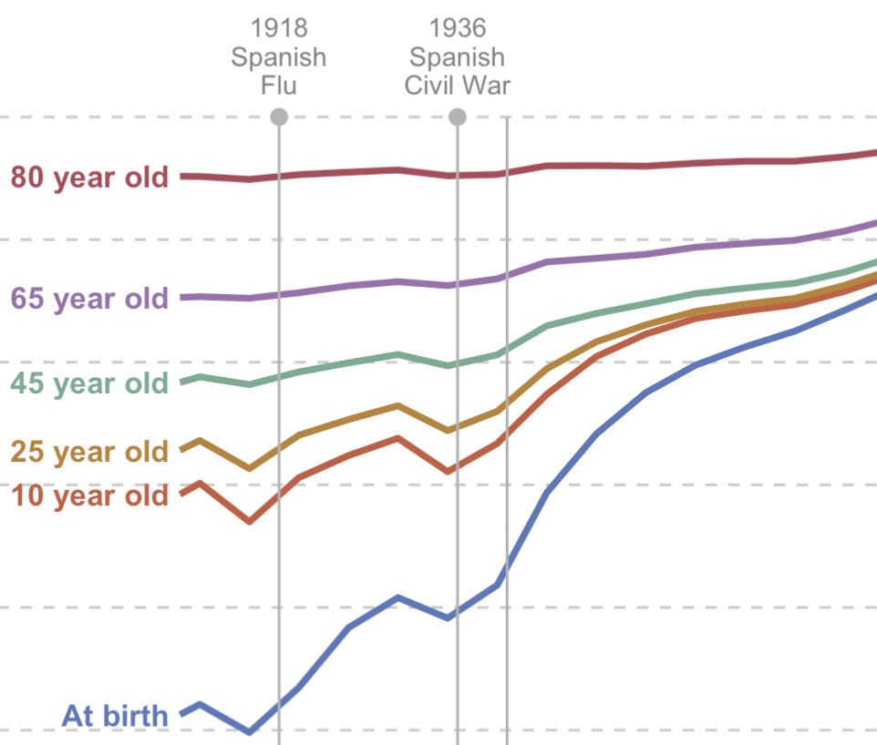
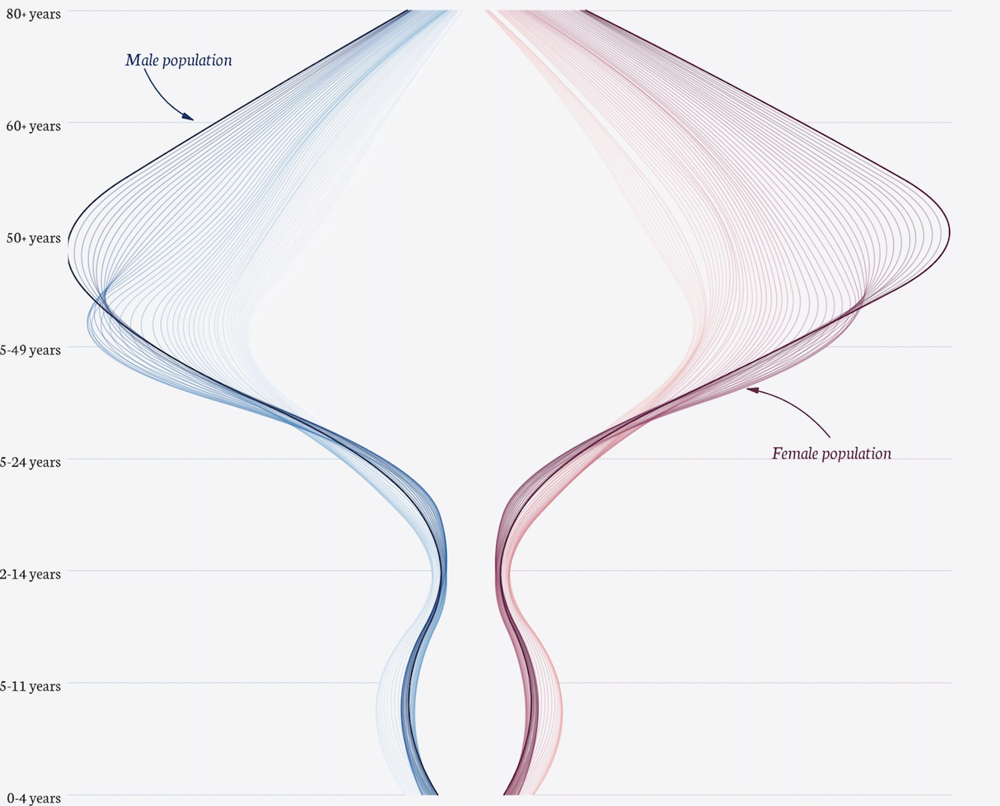
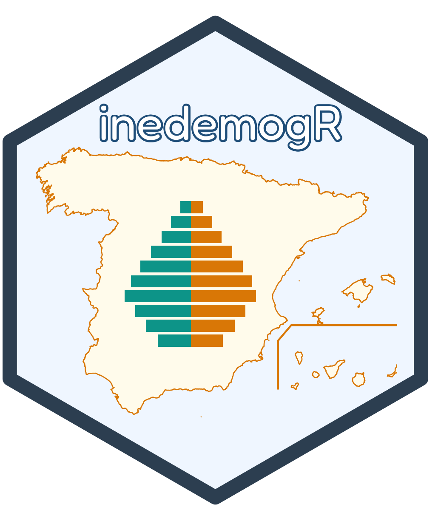
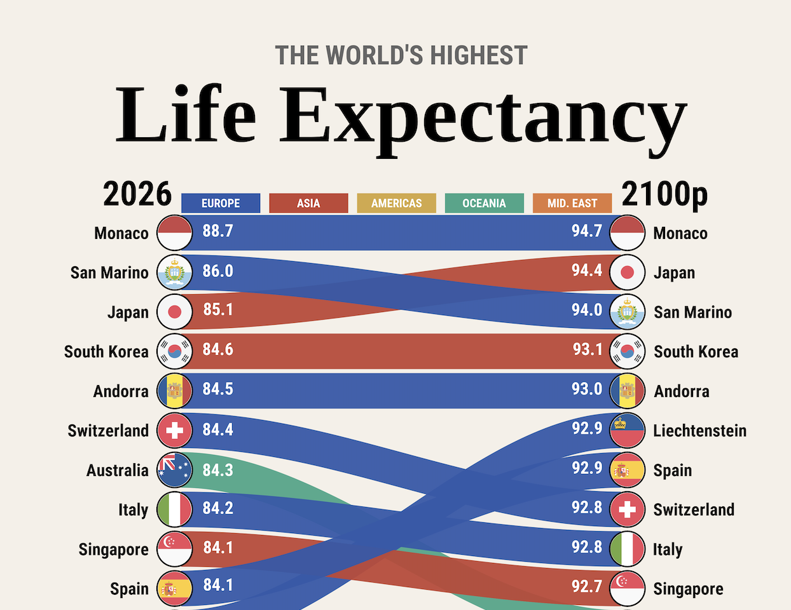

> "_Life is a chemical incident._" (Paul Ehrlich, 1870)

## Small Demographic Data Viz Projects

My current research projects involve mortality and fertility forecasting, demographic modelling and computational demography. These areas 
require extensive computational analyses, simulation studies, and the management of complex datasets. In 2026, during the stay at 
the [**Max Planck Institute for Demographic Research (MPIDR)**](https://www.demogr.mpg.de){target="_blank"} I came up with the idea of 
building this corner during long conversations with some researchers at the MPIDR to whom I am deeply grateful for their valuable contributions, 
whose websites served as the inspiration for this small section dedicated to demography and data visualization.

:::::: {.grid}

::::: {.card .g-col-12 .g-col-sm-4}

[{.card-img-top}](2025_life_expectancy/index.qmd)

:::: {.card-body}
#### Spanish Life Expectancy

Take a look at **life expectancy in Spain** since the beginning of the century
::::

:::::

::::: {.card .g-col-12 .g-col-sm-4}

[{.card-img-top}](2026_demographic_dividend/index.qmd)

:::: {.card-body}
#### Demographic Dividend

Check the shrinkage of the Spanish demographic dividend and the changing age structure

::::

:::::

::::: {.card .g-col-12 .g-col-sm-4}

[{.card-img-top .mx-auto .d-block width=70%}](2026_shinyapp/index.qmd)

:::: {.card-body}
#### The Spanish Life Expectancy Dashboard

Explore the interactive dashboard that visualizes life expectancy and mortality data for Spain

[ Site](https://jrcaro.shinyapps.io/shiny-app/){.card-link} [ Source](https://github.com/jrcarob/Spanish_life_expectancy_Dashboard){.card-link} 

::::

:::::

::::::

:::::: {.grid}

::::: {.card .g-col-12 .g-col-sm-4}

[{.card-img-top}](2026_worldwide_lexp/index.qmd)

:::: {.card-body}
#### Worldwide Highest Life Expectancy

Data Viz of **highest life expectancy** projections worldwide

[ Source](https://github.com/jrcarob/Highest_Life_Expectancy){.card-link}

<!--::: {.card-description}-->
<!--Take a look at **life expectancy in Spain** since the beginning of the century"-->
<!--:::-->
::::

:::::

::::::

>This page is under construction, but most of my projects are open source and can be found in my [GitHub repositories](https://github.com/jrcarob). This includes all of the materials for my [course websites](../teaching/index.qmd) and course content, if you cannot find something you are interested in, please, write me an [e-mail](mailto:jrcaro@uco.es) and I will provide you the materials.

