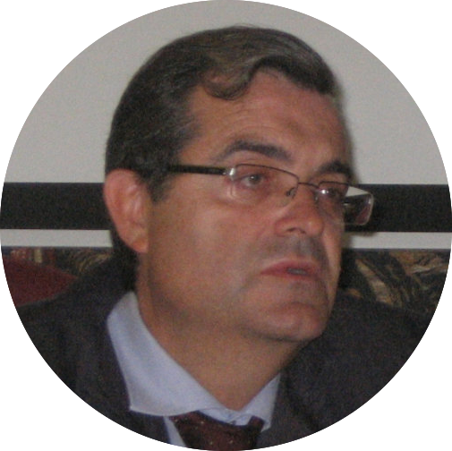
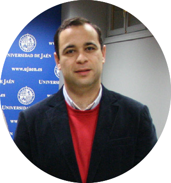
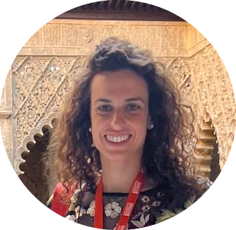
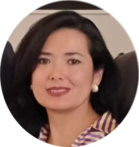
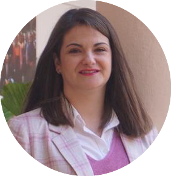

As of Sept 30, 2019, I'm involved in several projects with my

# Research Group SEJ-670 MECUANECO

The research group MECUANECO (Quantitative Methods for Economics) emerged in **2019** as a result of the coming together of academic researchers with diverse profiles: economics, finance, statistics and quantitative methods. The group focuses on quantitative and applied research in **economics**, **finance**, **tourism and related fields**. Its work combines economic analysis with mathematical and statistical methods, addressing contemporary economic and social challenges through rigorous empirical and computational approaches.

::: {.grid}

::: {.g-col-10 .g-col-sm-2}

```{=html}
<picture>
  
<picture>
```
:::

::: {.g-col-12 .g-col-sm-10}

**Jesús Pérez Gálvez**, _Senior Lecturer_. As the **Head of the research group**, Prof. Pérez Gálvez has a long experience and a prolific career at the [University of Córdoba](https://www.uco.es/). After _25 years of experience_ and _more than 40 publications_ in high impact journals, is a highly regarded researcher and a renowned teacher. His experience in the fields of tourism and economics make him a leader in these areas. [](https://orcid.org/0000-0002-6204-2412){target="_blank"}

:::

:::

::: {.grid}

::: {.g-col-10 .g-col-sm-2}

```{=html}
<picture>
  
<picture>
```
:::

::: {.g-col-12 .g-col-sm-10}

**Miguel Jesús Medina Viruel**, _Senior Lecturer_, [Department of Statistics & Operational Research, Applied Statistics and Management Organization](https://www.uco.es/organiza/departamentos/estadistica/) at the [University of Córdoba](https://www.uco.es/). [](https://orcid.org/0000-0001-8448-3393){target="_blank"}

:::

:::

::: {.grid}

::: {.g-col-10 .g-col-sm-2}

```{=html}
<picture>
  
<picture>
```
:::

::: {.g-col-12 .g-col-sm-10}

**Gema Gómez-Casero Fuentes**, _Assistant Professor_, [Department of Statistics & Operational Research, Applied Statistics and Management Organization](https://www.uco.es/organiza/departamentos/estadistica/) at the [University of Córdoba](https://www.uco.es/). [](https://orcid.org/0000-0001-5196-9215){target="_blank"}

:::

:::

::: {.grid}

::: {.g-col-10 .g-col-sm-2}

```{=html}
<picture>
  
<picture>
```
:::

::: {.g-col-12 .g-col-sm-10}

**Carol Angélica Jara Alba**, _Assistant Professor_, [Department of Statistics & Operational Research, Applied Statistics and Management Organization](https://www.uco.es/organiza/departamentos/estadistica/) at the [University of Córdoba](https://www.uco.es/). [](https://orcid.org/0000-0003-1365-4735){target="_blank"}

:::

:::

::: {.grid}

::: {.g-col-10 .g-col-sm-2}

```{=html}
<picture>
  
<picture>
```
:::

::: {.g-col-12 .g-col-sm-10}

**Jaime Orts Cardador**, _Assistant Professor_, [Department of Statistics & Operational Research, Applied Statistics and Management Organization](https://www.uco.es/organiza/departamentos/estadistica/) at the [University of Córdoba](https://www.uco.es/). [](https://orcid.org/0000-0002-1229-8161){target="_blank"}

:::

:::

::: {.grid}

::: {.g-col-10 .g-col-sm-2}

```{=html}
<picture>
  
<picture>
```
:::

::: {.g-col-12 .g-col-sm-10}

**María de los Baños García-Moreno García**, _Assistant Professor_, [Department of Statistics & Operational Research, Applied Statistics and Management Organization](https://www.uco.es/organiza/departamentos/estadistica/) at the [University of Córdoba](https://www.uco.es/). [](https://orcid.org/0000-0002-7981-8846){target="_blank"}

:::

:::

::: {.grid}

::: {.g-col-10 .g-col-sm-2}

```{=html}
<picture>
  
<picture>
```
:::

::: {.g-col-12 .g-col-sm-10}

**Mónica Torres Naranjo**, _Assistant Professor_, Department of Applied Economics at the [Escuela Superior Politécnica del Litoral, Guayaquil, Ecuador](https://www.espol.edu.ec/en). [](https://orcid.org/0000-0002-0653-1297){target="_blank"}

:::

:::


## What I like the most

- Practising sports has been a constant habit in my life. I usually run (preferably early) in the morning and combine it with boxing.
- Living in Córdoba and working as an interim professor in the [Department of Statistics & Operational Research, Applied Statistics and Management Organization](https://www.uco.es/organiza/departamentos/estadistica/).
- Teaching financial mathematics, microeconomics and macroeconomics at the [Faculty of Law and Business Administration](https://uco.es/derechoyccee/es) at [University of Córdoba](https://www.uco.es/).
- The exposure to international research standards has further reinforced my interest in [Open Science](https://www.cos.io/open-science) and reproducible research, I am actively developing plans to establish more systematic reproducible research practices within my home institution and to organize workshops for graduate students and researchers on topics such as reproducible workflows in R, dynamic reporting, [FAIR](https://www.go-fair.org/fair-principles/) data management, code sharing, and research transparency.
- I maintain an active [GitHub profile](https://github.com/jrcarob){target="_blank"} where I share code, analytical workflows, and research-related repositories. I also use **Open Science platforms** such as [Zenodo](https://zenodo.org/search?q=caro-barrera&l=list&p=1&s=10&sort=bestmatch){target="_blank"}, [OSF](https://osf.io/ej4xb/){target="_blank"} and [Figshare](https://figshare.com/authors/Jos_Rafael_Caro_Barrera/23046208){target="_blank"} to archive research outputs, facilitate long-term accessibility, and support transparent dissemination of scientific work.
- I routinely document analytical procedures, maintain structured research workflows, and progressively incorporate version control and dependency management practices using Git and `renv`.


