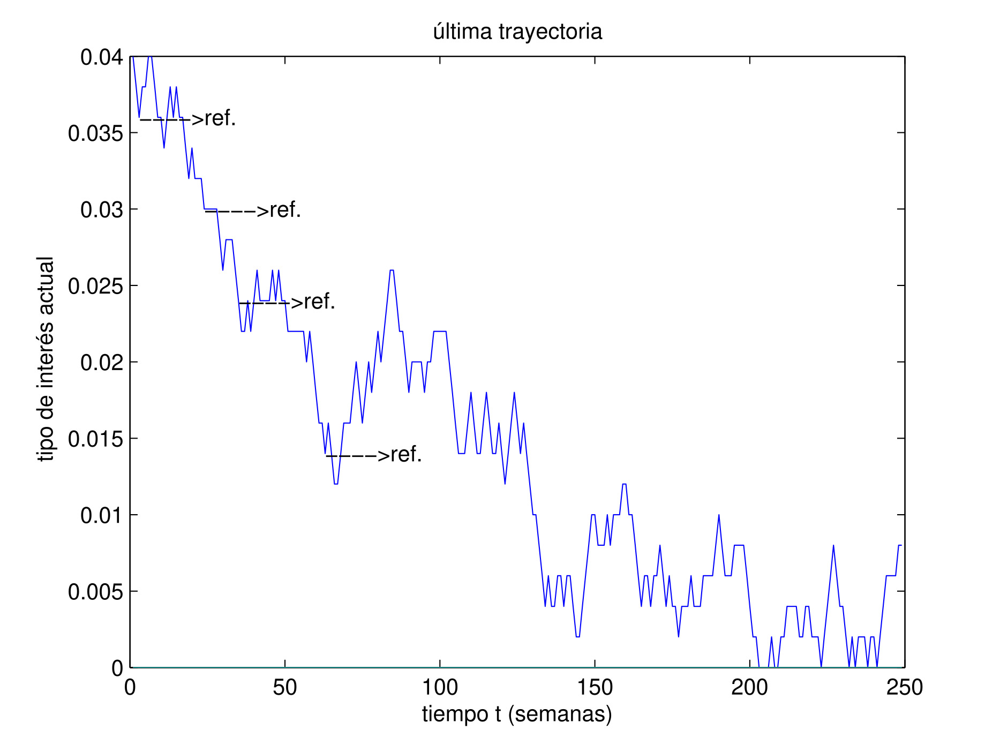

 <!--&emsp;  &emsp; -->

## Important links

- [Paper (preprint)](20191031.pdf){target="_blank"}
- University of Córdoba official repositories: [{width="150"}](https://helvia.uco.es/handle/10396/29584){target="_blank"}


## Abstract

Facing an hypothetical, but increasingly, case of default risk on a mortgage or a fall in interest rates, an important issue raised by the borrower is the possibility of minimizing that risk by selecting the best refinancing option. In this paper, a mortgage refinancing model is presented, developing a purely quantitative programming method with a simulation based on an algorithm created especially for this case and that can be useful for mortgage debtors. Thus, we begin by explaining the theoretical basis on which the research is based, to proceed to develop the problem, continuing with its implementation. Finally, the results are analyzed and the most relevant conclusions are commented.


## Important figure

Figure 1: The optimal refinancing policy is expressed as a rule for transforming any possible configuration of the state variable into an action that consists of continuing or refinancing the mortgage. To get a concrete idea of the optimal policy, we plot a sample of the market rate process and indicate the four optimal refinancing times.




## Citation

<p class="buttons" style="text-align:center;">
<a class="btn btn-danger" target="_blank" href="https://www.zotero.org/save?type=doi&q=https://dialnet.unirioja.es/servlet/articulo?codigo=7182058">&emsp;Add to Zotero </a>
</p>

```bibtex
@article{Caro2019,
    Author = {Caro-Barrera, JR},
    Doi = {https://dialnet.unirioja.es/servlet/articulo?codigo=7182058},
    Journal = {Revista de Métodos Cuantitativos para la Economía y la Empresa},
    Month = {12},
    Number = {28},
    Pages = {183--197},
    Title = {Modelos de Riesgo de Crédito: Aplicación Práctica a un Modelo de Refinanciación de Hipotecas},
    Volume = {2},
    Year = {2019}}
```
