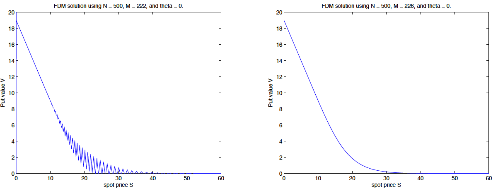

 &emsp;  &emsp; 

## Important links

- [Paper (preprint)](art-EEA_JR_Caro_Barrera_aceptado.pdf)
- [GitHub repository](https://github.com/jrcarob/Computational-Method-4-QF){target="_blank"} (testing versions with Python)
- [Experiment preregistration](https://osf.io/eajru/){target="_blank"} (simulation of pricing options with finite differences)
- University of Córdoba official repositories: [{width="150"}](https://helvia.uco.es/handle/10396/29455){target="_blank"}


## Abstract

The stochastic and probabilistic techniques play a fundamental role in the mathematical modeling of aspects related to the natural and social sciences. In physics, stochastic models are often used in areas as diverse as climatology, molecular biology, biochemistry, as well as economics.
The purpose of this paper is to propose the application to finance of models and processes used in the field of statistical physics, through techniques and results of the stochastic theory of processes and in particular of diffusion processes that, directly emerged and applied in the field of physics are useful in the field of financial economics. In our case, we intend to relate the Fokker-Planck equation to the model proposed by Black and Scholes, since the latter is modeled by a stochastic differential partial equation and similarities can be established with the stochastic and diffusion processes observed in physics.


## Important figure

Figure 1: The performance and accuracy of the numerical solution is performing simulations or tests for the values of $\theta$ both when condition (15) is satisfied and when it is not satisfied and we will compare the numerical solution with the Black-Scholes formula by plotting the absolute nodal error.




## Citation

<p class="buttons" style="text-align:center;">
<a class="btn btn-danger" target="_blank" href="https://www.zotero.org/save?type=doi&q=10.25115/eea.v37i2.2609">&emsp;Add to Zotero </a>
</p>

```bibtex
@article{Caro2019,
    Author = {Caro-Barrera, JR},
    Doi = {10.25115/eea.v37i2.2609},
    Journal = {Estudios de Economía Aplicada},
    Month = {10},
    Number = {37},
    Pages = {6--21},
    Title = {Projecting Spanish Fertility at Regional Level: A Hierarchical Bayesian Approach},
    Volume = {2},
    Year = {2019}}
```
