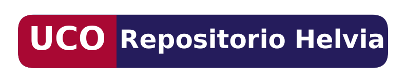
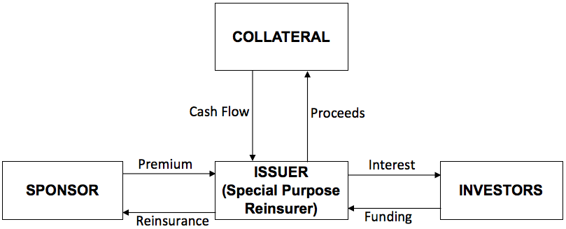

 <!--&emsp;  &emsp; -->

## Important links

- [Paper (preprint)](catbonds.pdf){target="_blank"}
- University of Córdoba's official repository [{width="150"}](https://helvia.uco.es/handle/10396/29586){target="_blank"}


## Abstract

In this paper,  we establish a comparison between one of the most traded financial derivatives  in  the  markets,  the so-called  catastrophe  bonds  (abbreviated  as  cat bonds)  and  the  corporate  bonds.  In  the  first  section,  we start  from  a  brief  definition as well as some basic concepts. In section two, we will enumerate the type  of  investors  to  whom  these  products  might  interesting  and  how  to  price  them. Afterwards, in section three we move onto the analysis of the trading rule proposed, that is, the comparison with Corporate bonds, our benchmark, in terms of expected returns. In sections four and five,  we will point out some key issues on how the credit risk associated to these products can be reduced and,  finally, in the last section, we will conclude with some discussions and remark the state-of-the-art research on this field.


## Important figure

Figure 3: A CAT  bond  is  conceptually  a  structured  note  where  the  coupon  payment  and/or  principal  repayment  by  the  issuer  is  contingent  upon  the  non-occurrence  of  a  specified  event-typically,  a  catastrophe  event  such  hurricanes,  droughts,  floods,  earthquakes,  wildfires,  extreme  weather,  etc.  In essence, the CAT bond structure creates a direct nexus between payment of interest or principal and the catastrophe risk.




## Citation

<p class="buttons" style="text-align:center;">
<a class="btn btn-danger" target="_blank" href="https://www.zotero.org/save?type=doi&q=10.46661/revmetodoscuanteconempresa.2978">&emsp;Add to Zotero </a>
</p>

```bibtex
@article{Caro2020,
    Author = {Caro-Barrera, JR},
    Doi = {10.46661/revmetodoscuanteconempresa.2978},
    Journal = {Revista de Métodos Cuantitativos para la Economía y Empresa},
    Month = {01},
    Number = {29},
    Pages = {3--17},
    Title = {Insurance Options: Beating the Benchmark. Are Catastrophe Bonds more profitable than Corporate Bonds?},
    Volume = {2},
    Year = {2020}}
```
