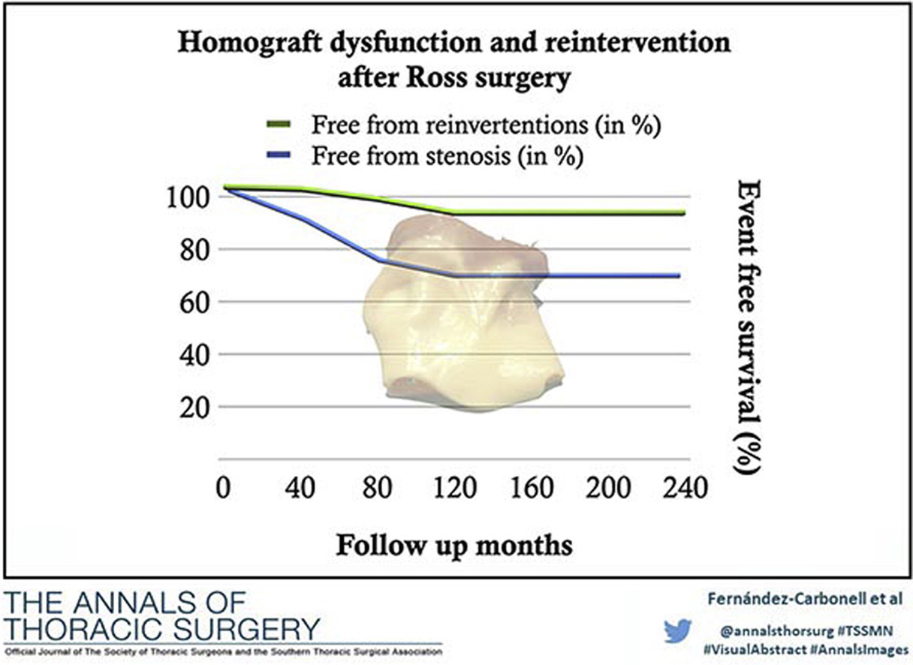

 <!--&emsp;  &emsp; -->

## Important links

- [Paper (preprint)](journal_pre-proof.pdf){target="_blank"}
- University of Córdoba's official repository [{width="150"}](https://helvia.uco.es/xmlui/handle/10396/37013){target="_blank"}


## Background

We studied the determinants of hemodynamics and analyzed the incidence, risk factors, and clinical impact of pulmonary homograft dysfunction following Ross surgery, after a 20-year follow-up at our referral center.

## Methods

From 1997 to 2017, a total of 142 patients underwent surgery using the Ross procedure. The development of moderate-severe stenosis (peak transhomograft pressure gradient 36 mm Hg or greater) and surgical or percutaneous Ross homograft reinterventions were evaluated by echocardiography in the immediate postoperative period and at annual intervals.

## Conclusions

Pulmonary homografts implanted in the Ross procedure offer satisfactory long-term results, but the level of homograft dysfunction is not negligible. Young recipient and donor age were associated with a higher rate of homograft stenosis during follow-up. Moreover, homograft dysfunction usually occurred during the first few years of follow-up, and may have been related to immune responses.




## Citation

<p class="buttons" style="text-align:center;">
<a class="btn btn-danger" target="_blank" href="https://www.zotero.org/save?type=doi&q=0.1016/j.athoracsur.2020.06.032">&emsp;Add to Zotero </a>
</p>

```bibtex
@article{cite-key,
	title = {Predictive Factors for Pulmonary Homograft Dysfunction After Ross Surgery: A 20-Year Follow-up},
	author = {Fern{\'a}ndez-Carbonell, Azahara and Rodr{\'\i}guez-Guerrero, Enrique and Merino-Cejas, Carlos and Conejero-Jurado, Mar{\'\i}a Teresa and Villalba-Montoro, Rafael and Romero-Morales, Mar{\'\i}a del Carmen and Alados-Arboledas, Pedro and Casares-Mediavilla, Jaime and Fern{\'a}ndez-Carbonell, Marta and L{\'o}pez-Cillero, Pedro and Caro-Barrera, Jos{\'e}Rafael},
	journal = {The Annals of Thoracic Surgery},
	date = {2021/04/01},
	doi = {10.1016/j.athoracsur.2020.06.032},
	number = {4},
	pages = {1338--1344},
	publisher = {Elsevier},
	type = {doi: 10.1016/j.athoracsur.2020.06.032},
	url = {https://doi.org/10.1016/j.athoracsur.2020.06.032},
	volume = {111},
	year = {2021}}
```


