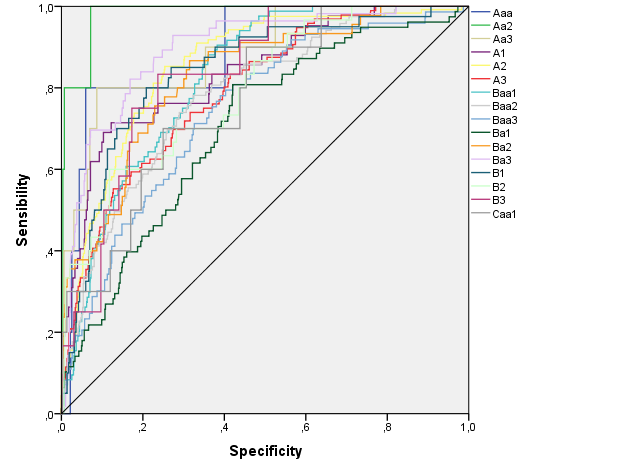

 <!--&emsp;  &emsp; -->

## Important links

- [Paper (preprint)](economies-1281435-pre.pdf){target="_blank"}
- University of Córdoba's official repository [{width="150"}](https://helvia.uco.es/handle/10396/21889){target="_blank"}


## Abstract

Long-term ratings of companies are obtained from public data plus some additional nondisclosed information. A model based on data from firms’ public accounts is proposed to directly obtain these ratings, showing fairly close similitude with published results from Credit Rating Agencies. The rating models used to assess the creditworthiness of a firm may involve some possible conflicts of interest, as companies pay for most of the rating process and are, thus, clients of the rating firms. Such loss of faith among investors and criticism toward the rating agencies were especially severe during the financial crisis in 2008. To overcome this issue, several alternatives are addressed; in particular, the focus is on elaborating a rating model for Moody’s long-term companies’ ratings for industrial and retailing firms that could be useful as an external check of published rates. Statistical and artificial intelligence methods are used to obtain direct prediction of awarded rates in these sectors, without aggregating adjacent classes, which is usual in previous literature. This approach achieves an easy-to-replicate methodology for real rating forecasts based only on public available data, without incurring the costs associated with the rating process, while achieving a higher accuracy. With additional sampling information, these models can be extended to other sectors.


## Important Figures

 

 


## Citation

<p class="buttons" style="text-align:center;">
<a class="btn btn-danger" target="_blank" href="https://www.zotero.org/save?type=doi&q=10.3390/economies9040154">&emsp;Add to Zotero </a>
</p>

```bibtex
@Article{economies9040154,
AUTHOR = {Caridad y López del Río, Lorena and García-Moreno García, María de los Baños and Caro-Barrera, José Rafael and Pérez-Priego, Manuel Adolfo and Caridad y López del Río, Daniel},
TITLE = {Moody’s Ratings Statistical Forecasting for Industrial and Retail Firms},
JOURNAL = {Economies},
VOLUME = {9},
YEAR = {2021},
NUMBER = {4},
ARTICLE-NUMBER = {154},
URL = {https://www.mdpi.com/2227-7099/9/4/154},
ISSN = {2227-7099},
DOI = {10.3390/economies9040154}
}
```
