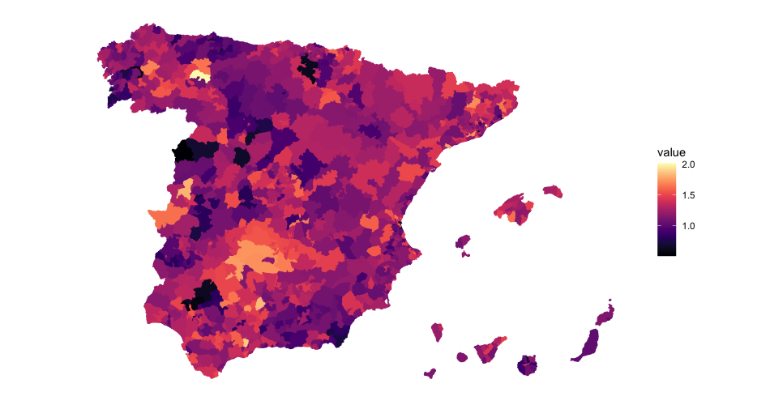

 &emsp;  &emsp; 

## Important links

- [Paper (preprint)](manuscript_vers_04-oct.pdf){target="_blank"}
- [Appendix (preprint)](s1.pdf){target="_blank"}
- [GitHub repository](https://github.com/jrcarob/Fertility_projection_modeling){target="_blank"}
- [Experiment preregistration](https://osf.io/9bnkh/){target="_blank"} (fertility project)
- University of Córdoba's official repository [{width="150"}](https://helvia.uco.es/handle/10396/29398){target="_blank"}


## Abstract

The transition from a demographic regime of high mortality and high fertility to one with low mortality and low fertility is universal and comes along with the process of socio-economic modernization. The Spanish total fertility rate has decreased to below replacement levels in the last decades. The decline has persisted since the 1960s and is diverse across the country. Based on that diversity, the use of population forecasts, not only at national but at regional levels, for planning purposes (governments and private sector) with large horizons has become a must to provide essential services. Using a Bayesian hierarchical model we constructed probabilistic fertility forecasts for Spain at the regional level. Although this approach is already issued by the United Nations little research has been done focusing on the Spanish subnational level. Our objective is to disaggregate the national projections of the total fertility rate for Spain into regional forecasts. The results of this research will show the model fitting, first to the national level and then using a multifaceted and continuous evolution of fertility over time, at the regional level, to check its convergence.


## Important figure

Figure 3: Spanish TFR at the municipality level. This level shows that in most municipalities the TFR is lower than 2.0 and especially remarkable are those with a TFR close to 0. As the size of the municipalities has an impact on birth rates, the characteristics of these barren territories where TFR is almost 0, are usually quite similar: inland, sparsely populated and ageing.




## Citation

<p class="buttons" style="text-align:center;">
<a class="btn btn-danger" target="_blank" href="https://www.zotero.org/save?type=doi&q=10.1371/journal.pone.0275492">&emsp;Add to Zotero </a>
</p>

```bibtex
@article{CaroGarciaPerez:2022,
    Author = {Caro-Barrera, JR and García-Moreno García, MB. and Pérez Priego, M.},
    Doi = {10.1371/journal.pone.0275492},
    Journal = {PLoS One},
    Month = {10},
    Number = {17},
    Pages = {1--27},
    Title = {Projecting Spanish Fertility at Regional Level: A Hierarchical Bayesian Approach},
    Volume = {10},
    Year = {2022}}
```
