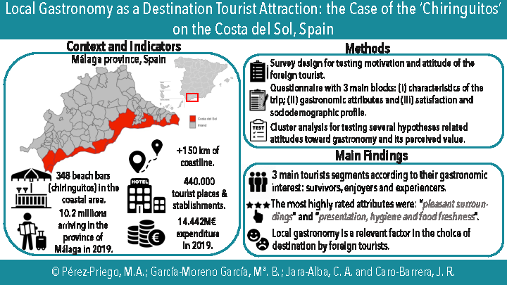

 <!--&emsp;  &emsp; -->

## Important links

- [Paper (preprint)](elsarticle-template-harv.pdf){target="_blank"}
- University of Córdoba's official repository [{width="150"}](https://helvia.uco.es/handle/10396/29399){target="_blank"}


## Abstract

The purpose of this study is to analyse whether the local gastronomy of the Costa del Sol in Malaga (Spain) is a relevant factor in the choice of destination by foreign tourists. Specifically, it analyses the culinary offer and the gastronomic characteristics of the food and the service offered in the typical beach-bars: the Chiringuitos. The authors began their research with fieldwork based on opinions of tourists collected through questionnaires completed after their gastronomic experience. The results revealed three different groups of tourists according to their attitudes towards local gastronomy, with different predispositions and gastronomic knowledge. The authors concluded that tourists have different levels of satisfaction and motivation depending on whether the tourists were identified as being in one particular segment or another. This research aims to fill the literature gap on gastronomic interest in a destination traditionally focused on sunshine tourism.


## Graphical Abstract

Main overview of the structure of the research: context and indicators, methodology proposed and main findings and results.




## Citation

<p class="buttons" style="text-align:center;">
<a class="btn btn-danger" target="_blank" href="https://www.zotero.org/save?type=doi&q=10.1016/j.ijgfs.2023.100822">&emsp;Add to Zotero </a>
</p>

```bibtex
@article{PEREZPRIEGO2023100822,
title = {Local gastronomy as a destination tourist attraction: The case of the ‘Chiringuitos’ on the Costa del Sol (Spain)},
journal = {International Journal of Gastronomy and Food Science},
volume = {34},
pages = {100822},
year = {2023},
issn = {1878-450X},
doi = {https://doi.org/10.1016/j.ijgfs.2023.100822},
url = {https://www.sciencedirect.com/science/article/pii/S1878450X23001646},
author = {Manuel Adolfo Pérez-Priego and María de los Baños {García-Moreno García} and Carol Jara-Alba and José Rafael Caro-Barrera}
}
```
