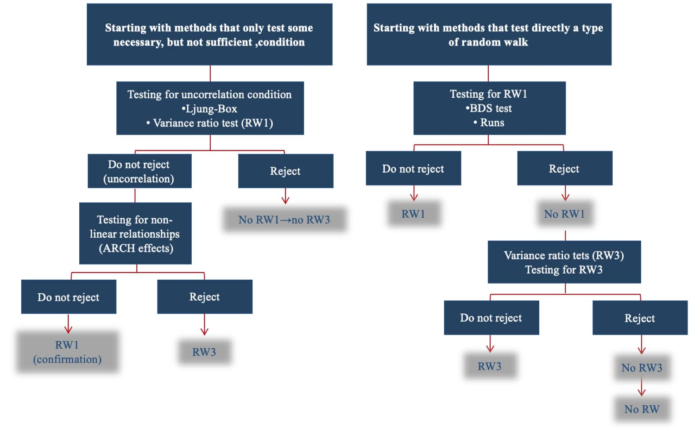

 <!--&emsp;  &emsp; -->

## Important links

- [Paper (preprint)](12_Perez-Priego_etal.pdf){target="_blank"}
<!-- - {width="150"} (To update)-->


## Abstract

This study analyses the impact of the pandemic on the poor performance of stock markets in Latin America and the Caribbean (LAC) by examining the COLCAP, BOVESPA, IPSA, MERVAL and MEXBOL indices between January 2018 and March 2021, with a particular focus on the first half of 2020. The proposed methodology is relatively new and consists of a sequential combination of statistical tests designed to determine whether index returns follow a random walk, and if so, what type this is. Empirical evidence shows that sharp price declines and increased volatility associated with the pandemic generally favoured weak-form efficiency in these markets. This reduced short-term return predictability and reinforced the role of prices in processing available information quickly. Additionally, the results imply that the impact of the pandemic on LAC markets was not uniform, but it did lead to a faster and more consistent incorporation of global and local news into stock prices, with significant implications for investor risk management and policymakers responsible for financial stability.

## Methodology and Countries Analyzed

Main overview of the structure of the research: context and indicators, methodology proposed and main findings and results.




## Citation

<p class="buttons" style="text-align:center;">
<a class="btn btn-danger" target="_blank" href="https://www.zotero.org/save?type=doi&q=10.12795/rea.2026.i51.12">&emsp;Add to Zotero </a>
</p>

```bibtex
@article{PerezPriegoEtAl2026,
  author  = {P{\'e}rez-Priego, Manuel Adolfo and Garc{\'i}a-Moreno Garc{\'i}a, Mar{\'i}a de los Ba{\~n}os and L{\'o}pez del R{\'i}o, Lorena Caridad and Caro-Barrera, Jos{\'e} Rafael},
  title   = {Testing the weak form of the Efficient Market Hypothesis and the impact of COVID-19 in LAC countries},
  journal = {Revista de Estudios Andaluces},
  year    = {2026},
  volume  = {51},
  pages   = {241--267},
  doi     = {10.12795/rea.2026.i51.12}
  url     = {https://dx.doi.org/10.12795/rea.2026.i51.12}
}
```


