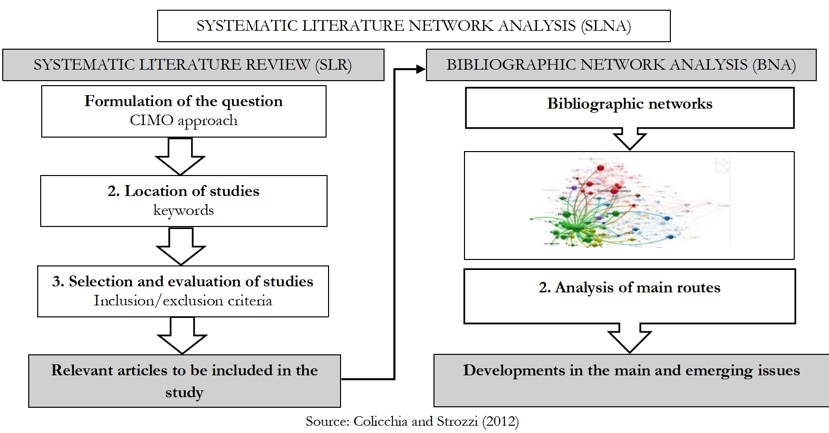
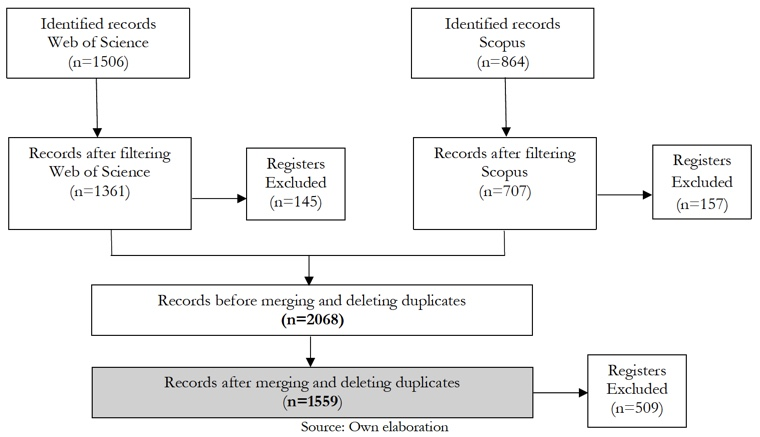
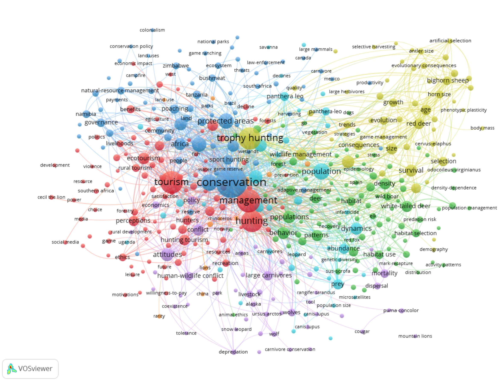

 <!--&emsp;  &emsp; -->

## Important links

- {width="150"} (To update).


## Abstract

Recreational and trophy hunting are controversial practices that intersect ecological conservation, ethical debates and socio-economic development. Only a few studies have been conducted on this subject; thus, this study analyses scientific literature on recreational and trophy hunting by applying the systematic literature network analysis methodology. It uses bibliometric software Bibliometrix and VOSviewer© to analyse a total of 1,559 scientific publications short-listed from the Web of Science© and Scopus© databases from 1971 to 2024. Geographically, there is a lack of research in regions with a hunting tradition. The study contribution extends to the academic and policy areas, establishing a basis for guiding future research and informed policymaking on trophy hunting with socio-economic benefits.

## Methodology






## Keywords Analysis




## Citation

<p class="buttons" style="text-align:center;">
<a class="btn btn-danger" target="_blank" href="https://www.zotero.org/save?type=doi&q=10.12795/rea.2026.i51.12">&emsp;Add to Zotero </a>
</p>

```bibtex
@article{Caro-Barrera_de los Baños García-Moreno García_Pérez Priego_2026,
  author  ={Caro-Barrera, José Rafael and de los Baños García-Moreno García, María and Pérez Priego, Manuel Adolfo}, 
  title ={Exploring trophy hunting and recreational hunting tourism: an analysis from a bibliometric perspective (1971–2024)}, 
  volume  ={25}, 
  url ={https://www.journals.vu.lt/TIBE/article/view/46180}, 
  DOI ={10.15388/Tibe.2026.25.2.6}, 
  abstractNote={
Recreational and trophy hunting are controversial practices that intersect ecological conservation, ethical debates and socio-economic development. Only a few studies have been conducted on this subject; thus, this study analyses scientific literature on recreational and trophy hunting by applying the systematic literature network analysis methodology. It uses bibliometric software Bibliometrix and VOSviewer© to analyse a total of 1,559 scientific publications short-listed from the Web of Science© and Scopus© databases from 1971 to 2024. Geographically, there is a lack of research in regions with a hunting tradition. The study contribution extends to the academic and policy areas, establishing a basis for guiding future research and informed policymaking on trophy hunting with socio-economic benefits.}, 
  number  ={2 (68)}, 
  journal ={Transformations In Business & Economics}, 
  year  ={2026}, 
  month ={Jul.}, 
  pages ={460–483} 
}
```


